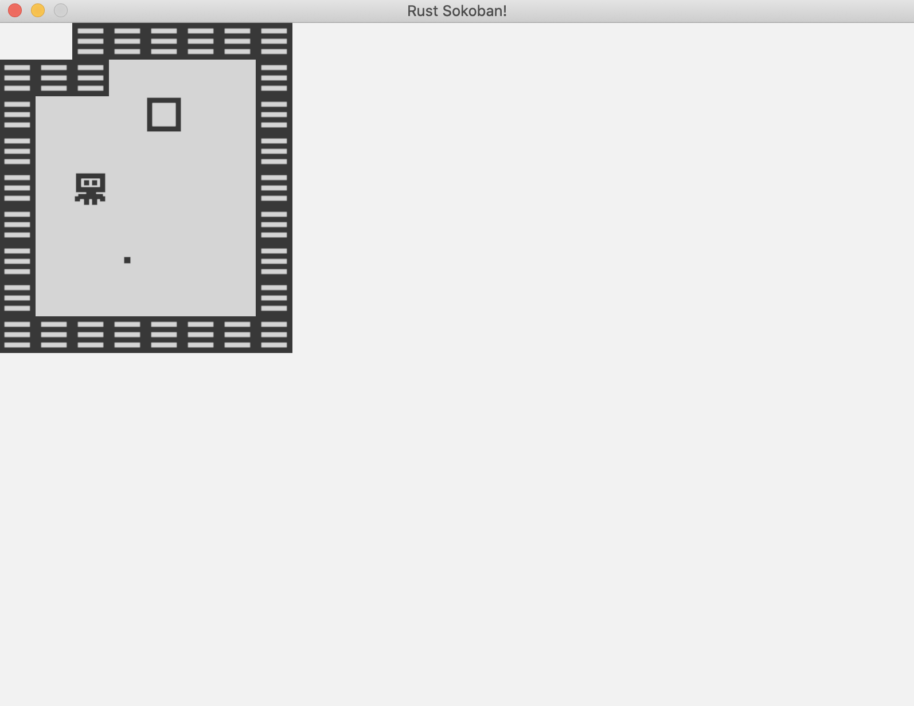

# Map loading

Last chapter we left off at creating some entities to test our rendering system, but now it's time to render a proper map. In this section we will create a text based map configuration which we will load.

## Map config
First step, let's try to load a level based on a 2d map that looks like this.

```
{{#include ../../../code/rust-sokoban-c02-01/src/main.rs:181:189}}

where:
. is an empty spot
W is a wall
P is the player
B is a box
S is a box spot
N is nothing: used for the outer edges of the map
```

Let's make a string for this, eventually we can load from a file but for simplicity let's go with a constant in the code for now.

```rust
{{#include ../../../code/rust-sokoban-c02-01/src/main.rs:179:193}}
```

And here is the implementation of load map.

```rust
{{#include ../../../code/rust-sokoban-c02-01/src/main.rs:195:234}}
```

The most interesting Rust concept here is probably the `match`. We are using the basic feature of pattern matching here, we are simply matching on the values of each token found in the map config, but we could do a lot of more advanced conditions or types of patterns.

> **_MORE:_**  Read more about pattern matching [here](https://doc.rust-lang.org/book/ch06-02-match.html).

Now let's run the game and see what our map looks like.



Final code below.

```rust
{{#include ../../../code/rust-sokoban-c02-01/src/main.rs}}
```

> **_CODELINK:_**  You can see the full code in this example [here](https://github.com/iolivia/rust-sokoban/tree/master/code/rust-sokoban-c02-01).
