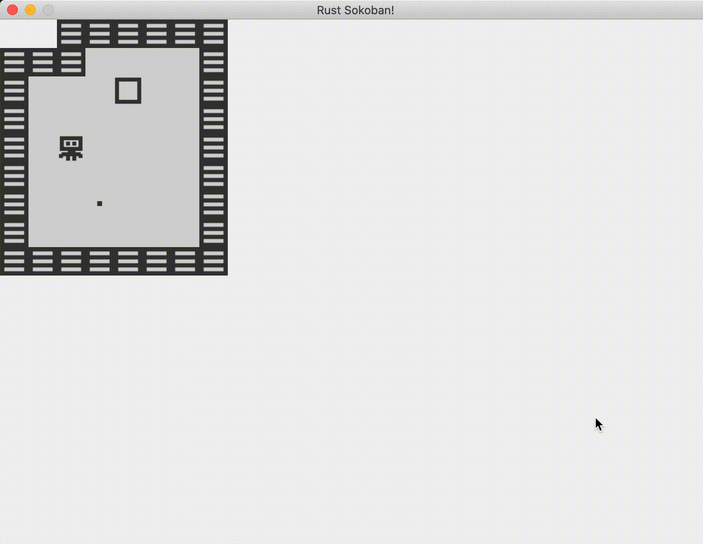

# Pushing boxes

In the previous chapter we got our player moving, but he is going through walls and boxes, not really interacting with the environment. In this section we'll add some logic for more intelligent player movement.

## Movement components
First, we need to make our code slightly more generic. If you remember the previous chapter we were operating on players to figure out where we should move them, but we'll also need to move boxes. Also in the future we might want to introduce another movable kind of object, so let's try to build something with that in mind. What we'll do in true ECS spirit we will use a marker component to tell us which entities are movable and which aren't. For example, players and boxes are movable, while walls are immovable. Box spots are kind of irrelevant here because they do not move, but they also shouldn't affect the movement of players or boxes, so box spots will not have either of these components.

Here are our two new components, nothing too new apart from two minor things:
* we are using `NullStorage` which is slightly more efficient than using `VecStorage` since these two components will not have any fields, and are just used as markers
* we are implementing Default because that is a requirement for using NullStorage
* adding the two new components to our register_components function


```rust
{{#include ../../../code/rust-sokoban-c02-03/src/main.rs:55:62}}

{{#include ../../../code/rust-sokoban-c02-03/src/main.rs:250:259}}
```

Next, we'll add:
* with(Movable) to players and boxes
* with(Immovable) to walls
* do nothing with floors and box spots (as mentioned before they should not be part of our movement/collision system since they are inconsequential to the movement)

```rust
{{#include ../../../code/rust-sokoban-c02-03/src/main.rs:266:321}}
```

## Movement requirements
Now let's think of a few examples that illustrate our requirements for movement. This will help us understand how we need to change the implementation of the input system to use `Movable` and `Immovable` correctly.

Scenarios:
1. `(player, floor)` and `RIGHT` pressed -> player should move to the right
1. `(player, wall)` and `RIGHT` pressed -> player should not move to the right
1. `(player, box, floor)` and `RIGHT` pressed -> player should move to the right, box should move to the right
1. `(player, box, wall)` and `RIGHT` pressed -> nothing should move
1. `(player, box, box, floor)` and `RIGHT` pressed -> player, box1 and box2 should all move one to the right
1. `(player, box, box, wall)` and `RIGHT` pressed -> nothing should move

A few observations we can make based on this:
* the collision/movement detection should happen all at once for all objects involved - for example, for scenario 6 if we processed one item at a time, we would move the player, we would move the first box, and when we get to the second box we realize we cannot move it, and we'd have to roll back all our movement actions, which will not work. So for every input, we must figure out all the objects involved and holistically decide if the action is possible or not.
* a chain of movables with an empty spot can move (empty spot in this case means something neither movable or immovable)
* a chain of movables with an immovable spot cannot move
* even though all examples were moving to the right, the rules should generalize for any movement and the key pressed should just influence how we find the chain

So given this, let's start implementing this logic. Let's think about the logical pieces we need. Some initial ideas:
1. **find all the movable and immovable entities** - this is so we can figure out if they are affected by the movement
2. **figure out which way to move based on a key** - we've kind of figured this out in the previous section already, basically a bunch of +1/-1 operations based on the key enum
3. **iterate through all positions between the player and the end of the map** on the correct axis based on the direction - for example, if we press right, we need to go from player.x to map_width, if we press up we need to go from 0 to player.y
4. **for every tile in this sequence** we need to:
    * if the tile is movable, continue and remember this tile
    * if the tile is not movable, stop and don't move anything
    * if the tile is neither movable or immovable, move all the tiles we've remembered so far

Here is the new implementation of the input systems, it's a bit long but hopefully it makes sense.

```rust
{{#include ../../../code/rust-sokoban-c02-03/src/main.rs:113:197}}
```

Now if we run the code, we'll see it actually works! We can't go through walls anymore and we can push the box and it stops when it gets to the wall.



Full code below.

```rust
{{#include ../../../code/rust-sokoban-c02-03/src/main.rs}}
```

> **_CODELINK:_**  You can see the full code in this example [here](https://github.com/iolivia/rust-sokoban/tree/master/code/rust-sokoban-c02-03).