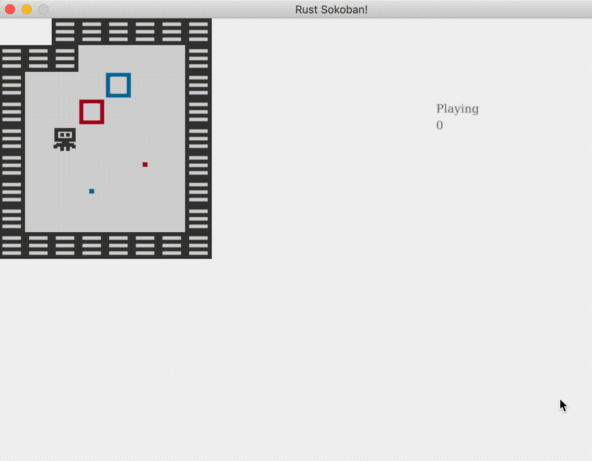

# Coloured boxes
It's time for a little more flair in our game! The gameplay so far is quite simple, put the box on the spot. Let's make it more exciting by adding different coloured boxes. We'll go with red and blue for now but feel free to adapt this to your preference, and create more colours! To win now you'll have to put the box on the same colour spot to win.

## Assets
First let's add the new assets, right click and download these as images, or create your own!


The directory structure should look like this (notice we've removed the old default box and default spot).

```
├── resources
│   └── images
│       ├── box_blue.png
│       ├── box_red.png
│       ├── box_spot_blue.png
│       ├── box_spot_red.png
│       ├── floor.png
│       ├── player.png
│       └── wall.png
├── src
│   ├── systems
│   │   ├── gameplay_state_system.rs
│   │   ├── input_system.rs
│   │   ├── mod.rs
│   │   └── rendering_system.rs
│   ├── components.rs
│   ├── constants.rs
│   ├── entities.rs
│   ├── main.rs
│   ├── map.rs
│   └── resources.rs
├── Cargo.lock
├── Cargo.toml
```

## Component changes
Now let's add an enum for the colour (if you chose to implement more than two colours you'll have to add them here).

```rust
// components.rs
{{#include ../../../code/rust-sokoban-c03-01/src/components.rs:29:32}}
```

Now let's use this enum both for the box and the spot. 

```rust
// components.rs
{{#include ../../../code/rust-sokoban-c03-01/src/components.rs:44:54}}
```

## Entity creation
Let's also add the colour as a parameter when we created boxes and spots and make sure we pass the correct asset path based on the colour enum. 

In order to create the correct string for the asset path we basically want `"/images/box_{}.png"` where `{}` is the colour of the box we are trying to create. The challenge we have now is that we are using an enum for the colour, so the Rust compiler will not know how to convert `BoxColour::Red` into `"red"`. It would be really cool to be able to do `colour.to_string()` and get the right value. Fortunately, Rust has a nice way for us to do this, we need to implement the `Display` trait on the `BoxColour` enum. Here is how that looks like, we simply specify how to map each variant of the enum into a string.

```rust
// components.rs
{{#include ../../../code/rust-sokoban-c03-01/src/components.rs:34:43}}
```

Now let's include the colour in our entity creation code and use the fancy `colour.to_string()` we just made possible in the previous snippet.

```rust
// entities.rs
{{#include ../../../code/rust-sokoban-c03-01/src/entities.rs:27:48}}
```

## Map
Now let's change our map code to allow new options for coloured boxes and spots:
* "BB" for blue box
* "RB" for red box
* "BS" for blue spot 
* "RS" for red spot

```rust
// map.rs
{{#include ../../../code/rust-sokoban-c03-01/src/map.rs}}
```

And let's update our static map in the main.

```rust
// main.rs
{{#include ../../../code/rust-sokoban-c03-01/src/main.rs:65:80}}
```

## Gameplay
Now we've done the hard work, so we can go ahead and test this code out. You'll notice everything works, but there is a big gameplay bug. You can win by putting the red box on the blue spot and viceversa. Let's fix that. 

We've learnt before that data goes in components and behaviour goes in systems - as per ECS methodology. What we are discussing now is behaviour, so it must be in a system. Remember how we added a system for checking whether you've won or not? Well that is the exact place we are after.

Let's modify the run function and check the colour of the spot and the box match.

```rust
// gameplay_state_system.rs
{{#include ../../../code/rust-sokoban-c03-01/src/systems/gameplay_state_system.rs:20:52}}
```

Now if you compile the code at this point it should complain about the fact that we are trying to compare two enums with `==`. Rust doesn't know by default how to handle this, so we must tell it. The best way we can do that is add an implementation for the `PartialEq` trait.

```rust
// components.rs
{{#include ../../../code/rust-sokoban-c03-01/src/components.rs:28:32}}
```

Now is a good time to discuss these unusual `derive` annotations. We've used them before, but never got too deep into what they do. Derive attributes can be applied to structs or enums and they allow us to add default trait implementations to our types. For example here we are telling Rust to add the `PartialEq` default trait implementations to our `BoxColour` enum.

Here is how the `PartialEq` default implementation looks like, it just checks if something equals itself. If it does, the comparison succeeds and if it doesn't it fails. Don't worry too much about this if it doesn't make sense. 

```rust
pub trait PartialEq {
  fn eq(&self, other: &Self) -> bool;
  fn ne(&self, other: &Self) -> bool { !self.eq(other) };
}
```

So by adding the `#[derive(PartialEq)]` on top of the enum we are telling Rust that `BoxColour` now implements the partial eq trait we saw before, which means if we try to do `box_colour_1 == box_colour_2` it will use this implementation which will just check if the colour_1 object is the same as the colour_2 object. This is not the most sophisticated partial equality implementation, but it should do just fine for our usecase. 

> **_MORE:_**  Read more about PartialEq [here](https://doc.rust-lang.org/std/cmp/trait.PartialEq.html) and more about derivable traits [here](https://doc.rust-lang.org/book/appendix-03-derivable-traits.html).

Now we can compile the code the reap the rewards of our efforts by seeing the game run and telling us we've won only when we put the right box in the right spot!



> **_CODELINK:_**  You can see the full code in this example [here](https://github.com/iolivia/rust-sokoban/tree/master/code/rust-sokoban-c03-01).