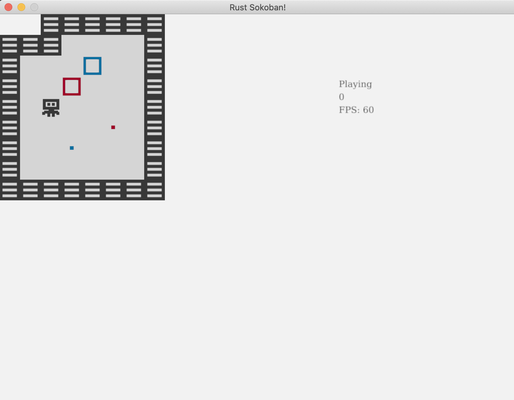

# Batch rendering

You might have noticed while playing the game that the input feels a bit slow. Let's add an FPS counter to see how fast we are rendering. If you are not familiar with the term FPS, it stands for Frames Per Second, and we are basically aiming for 60FPS.

## FPS counter
Let's start by adding an FPS counter, there are two parts to this:
1. getting or calculating the FPS value
1. rendering the value on the screen

For 1 luckily ggez provides a way to get the fps - see [here](https://docs.rs/ggez/0.1.0/ggez/timer/fn.get_fps.html). For 2 we already have a way to render text in the rendering system, so we just need to get the FPS there. Let's put all this together in the code.

```rust
// rendering_system.rs
{{#include ../../../code/rust-sokoban-c03-04/src/systems/rendering_system.rs:76}}
        ...

{{#include ../../../code/rust-sokoban-c03-04/src/systems/rendering_system.rs:124:128}}

        ...
{{#include ../../../code/rust-sokoban-c03-04/src/systems/rendering_system.rs:133}}
```

Run the game and move around with the keys a bit and you will see the FPS drops quite significantly from the expected 60. For me it looks to be in the range of 20-30 but depending on your machine it might be more or less. 


## What is causing the FPS drop?
Now you might be asking yourself, what have we done to make this so low? We have a fairly simple game and our logic for input and movement is not actually that complex, we also don't have that many entities or components to warrant such a big FPS drop. Well, to understand this we need to go a bit deeper into how our current rendering system works. 

Currently, for every renderable entity, we figure out which image to render, then load it and render it. This means that if we have 20 floor tiles we will load the floor image 20 times and issue 20 separate rendering calls. This is too expensive and it's the cause for our massive FPS drop.

How can we fix this? Well, we can use a technique called batch rendering. With this technique, what we have to do is only load the image once, and tell ggez to render it in all the 20 positions where it needs to be rendered. This way we not only load the image once, but we also only call render once per image, which will speed things up significantly. As a side note, some engines will do this render batching under the hood for you, but ggez doesn't, hence why we need to care.

A smaller improvement is to introduce image caching on top of batch rendering. This way our game will only load each image once in the first rendering cycle. In the consecutive rendering cycles, a clone of the cached image will be rendered instead of a freshly loaded one, which gives our game an additional performance boost. But first, let's implement batch rendering.

## Batch rendering
Here is what we'll have to do to implement batch rendering:
* for every renderable entity, figure out which image we need to render and at which DrawParams (this is what we currently give ggez as an indication of where to render)
* save all the (image, DrawParams) into a convenient format
* iterate through (image, DrawParams) on a per images basis sorted by z and make a single render call per image

Before we get deep into the rendering code, we will need to do some collection grouping and sorting, and we will use the itertools crate for that. We could implement this grouping ourselves, but there is no point re-inventing the wheel. Let's add itertools as a dependency to our project.

```toml
// Cargo.toml
{{#include ../../../code/rust-sokoban-c03-04/Cargo.toml:9:12}}
```

Let's also import it in the rendering system

```rust
// rendering_system.rs
{{#include ../../../code/rust-sokoban-c03-04/src/systems/rendering_system.rs:11}}
```

Now, remember that get_image function we wrote in the Animations chapter to figure out which image we need for every frame? We'll be able to re-use that we just need to ensure we don't actually load the image, but instead return the path to the image.

```rust
// rendering_system.rs
{{#include ../../../code/rust-sokoban-c03-04/src/systems/rendering_system.rs:37:54}}
```

Now let's figure out the format we want our batched data to be in. We will use a `HashMap<u8, HashMap<String, Vec<DrawParam>>>` where:
* the first key (`u8`) is the z position - remember we need to respect the z positions and draw from highest to smallest z to ensure the right order (for example floors should be below player, etc)
* the value is another `HashMap`, where the second key (`String`) is the path to the image
* finally, the last value is a `Vec<DrawParam>` which are all the params at which we must render that particular image

Let's now write the code to populate the rendering_batches hash map.

```rust
// rendering_system.rs
{{#include ../../../code/rust-sokoban-c03-04/src/systems/rendering_system.rs:76}}
        ...

{{#include ../../../code/rust-sokoban-c03-04/src/systems/rendering_system.rs:82:104}}

        ...
{{#include ../../../code/rust-sokoban-c03-04/src/systems/rendering_system.rs:133}}
```

Finally, let's actually render the batches. We will not be able to use the draw(image) function we used before but luckily ggez has a batching API - [SpriteBatch](https://docs.rs/ggez/0.5.1/ggez/graphics/spritebatch/struct.SpriteBatch.html). Also note the `sorted_by` here, that is provided to us to itertools. 

```rust
// rendering_system.rs
{{#include ../../../code/rust-sokoban-c03-04/src/systems/rendering_system.rs:76}}
        ...

{{#include ../../../code/rust-sokoban-c03-04/src/systems/rendering_system.rs:106:122}}

        ...
{{#include ../../../code/rust-sokoban-c03-04/src/systems/rendering_system.rs:133}}
```

And that's it for batch rendering! Run the game again and you should see a significant FPS improvement. If you are not yet at 60 FPS, don't worry, we are going to do one more performance improvement.


## Image caching

On top of batch rendering, we can boost our game performance by introducing a cache for the images. The idea is to keep the loaded images in memory, so we don't have to access and read the image files in every rendering cycle. Since we create a new rendering system in every cycle, the cache will have to live in the `Game` struct.

We are going to:
* add a `HashMap<String, Image>` called `image_cache` to the `Game` struct
* pass a mutable reference of the cache to the rendering system - it needs to be mutable since the rendering system will fill the cache on the fly
* add a new function in the rendering system to use the image cache - it will take an image path and check the cache for an existing image under that path. Either we return a clone of the cached image, or we load the image, add it to the cache, and then return it.

Let's introduce an initially empty image cache to our game and pass it on to the rendering system:
```rust
// main.rs
{{#include ../../../code/rust-sokoban-c03-04/src/main.rs:25:28}}
```

```rust
// main.rs
{{#include ../../../code/rust-sokoban-c03-04/src/main.rs:30}}
        ...

{{#include ../../../code/rust-sokoban-c03-04/src/main.rs:59:67}}
        ...

{{#include ../../../code/rust-sokoban-c03-04/src/main.rs:81}}
```

```rust
// main.rs
{{#include ../../../code/rust-sokoban-c03-04/src/main.rs:100}}
        ...

{{#include ../../../code/rust-sokoban-c03-04/src/main.rs:115:119}}
```

To actually use the cache for rendering we now need to adjust the rendering system:
```rust
// rendering_system.rs
{{#include ../../../code/rust-sokoban-c03-04/src/systems/rendering_system.rs:15:18}}
```

```rust
// rendering_system.rs
{{#include ../../../code/rust-sokoban-c03-04/src/systems/rendering_system.rs:20}}
        ...

{{#include ../../../code/rust-sokoban-c03-04/src/systems/rendering_system.rs:56:64}}
```

```rust
// rendering_system.rs
{{#include ../../../code/rust-sokoban-c03-04/src/systems/rendering_system.rs:76}}
        ...

{{#include ../../../code/rust-sokoban-c03-04/src/systems/rendering_system.rs:106:107}}
        ...

{{#include ../../../code/rust-sokoban-c03-04/src/systems/rendering_system.rs:111:112}}
        ...

{{#include ../../../code/rust-sokoban-c03-04/src/systems/rendering_system.rs:121:122}}
        ...

{{#include ../../../code/rust-sokoban-c03-04/src/systems/rendering_system.rs:133}}
```

If you run the game again, you should see a shiny 60FPS and everything should feel much smoother! Have fun playing!



> **_CODELINK:_**  You can see the full code in this example [here](https://github.com/iolivia/rust-sokoban/tree/master/code/rust-sokoban-c03-04).


