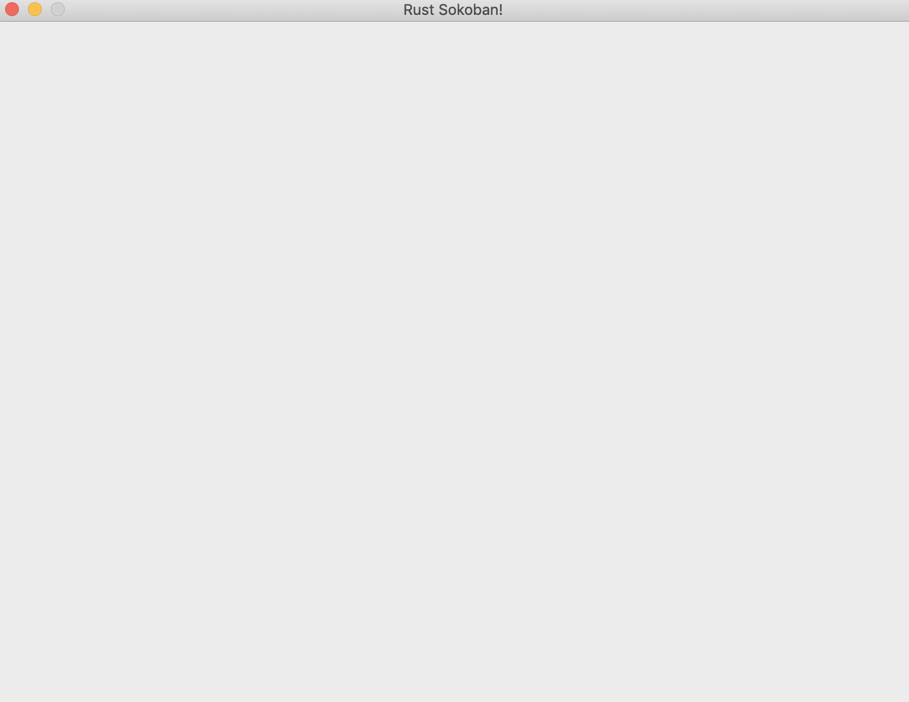

# Configuración del proyecto
Vamos a instalar [rustup](https://www.rust-lang.org/tools/install), con esto tendremos Rust y el compilador Rust. Ahora revisemos que todo esté instalado correctamente mediante los siguientes dos comandos; las versiones no deberían importar demasiado así que no te preocupes si las tuyas son diferentes.

```
$ rustc --version
rustc 1.40.0
$ cargo --version
cargo 1.40.0
```

## Creación de un proyecto

Cargo es el administrador de paquetes de Rust, lo utilizaremos para crear nuestro proyecto de juego. Muévete a un directorio en donde te gustaría que se encuentre el juego y ejecuta el comando siguiente, con esto crearemos un nuevo proyecto llamado `rust-sokoban` utilizando cargo.

```
$ cargo init rust-sokoban
```

Después de que el comando se ha ejecutado deberías tener la siguiente estructura de carpetas.

```
├── src
│   └── main.rs
└── Cargo.toml
```

Ahora podemos ejectuar `cargo run` en este directorio y deberíamos ver algo como lo siguiente.

```
$ cargo run
   Compiling rust-sokoban v0.1.0
    Finished dev [unoptimized + debuginfo] target(s) in 1.30s
     Running `../rust-sokoban/target/debug/rust-sokoban`
Hello, world!
```

## Convirtiéndolo en un juego
¡Es momento de converitr este proyecto básico hola mundo en un juego! Utilizaremos [ggez](https://ggez.rs/), uno de los motores de juegos 2D populares que existen.

¿Recuerdas el archivo `Cargo.toml` que vimos en nuestro directorio? Ese archivo se utiliza para la administración de crates (equivalente a biblioteca, dependencia o paquete en otros lenguajes), si queremos utilizar alguno de los crates de Rust los agregaremos a este archivo. Agreguemos [ggez](https://github.com/ggez/ggez) como una de nuestras dependencias.

> **_MORE:_**  Lee más sobre Cargo y los archivos toml [aquí](https://doc.rust-lang.org/book/ch01-03-hello-cargo.html).

```toml
[dependencies]
ggez = "0.5.1"
```

Ahora ejecutemos `cargo run` nuevamente y deberías ver algo como lo siguiente. Debería tomar un poco más de tiempo ya que buscará estas nuevas dependencias en [crates.io](https://crates.io), luego las compilará y finalmente las enlazará a nuestra biblioteca.

```
cargo run
    Updating crates.io index
    Downloaded ....
    ....
    Compiling ....
    ....
    Finished dev [unoptimized + debuginfo] target(s) in 2m 15s
    Running `.../rust-sokoban/target/debug/rust-sokoban`
    Hello, world!
```

> **_NOTA:_** Si estás siguiendo esta guía en Ubuntu, podrías necesitar instalar algunas dependencias adicionales. Si el paso anterior falla y ves algunos errores relacionados con `alsa` y `libudev`, instálalos ejecutando
```sudo apt-get install libudev-dev libasound2-dev```.

Ahora utilicemos ggez en el archivo principal y configuremos nuestra ventana. Este es el ejemplo más simple de un programa ggez que nos mostrará una ventana y nada más. Copia y pega lo siguiente en el archivo `main.rs` y ejecútalo de nuevo.

```rust
{{#include ../../../code/rust-sokoban-c01-01/src/main.rs}}
```

Deberías poder ver algo como esto.



## Conceptos básicos y sintaxis

Ahora que tenemos nuestra ventana básica, ahondaremos en el código que tenemos en main para entender algunos conceptos y la sintaxis de Rust.

### Importaciones
Posiblemente este es un concepto familiar de otros lenguajes de programación que conozcas, para poder tener disponibles tipos y espacios de nombre de nuestras dependencias (o crates) simplemente tenemos que declararlos utilizando `use`.

```rust
// esto importará conf, event, Context y GameResult del espacio de nombres ggez
{{#include ../../../code/rust-sokoban-c01-01/src/main.rs:1}}
```

### Declarando una estructura
```rust
// Esta estructura contrendrá todo el estado de nuestro juego
// Por ahora no hay nada, pero pronto agregaremos cosas
{{#include ../../../code/rust-sokoban-c01-01/src/main.rs:4:7}}
```

> **_MORE:_**  Lee más sobre estructuras [aquí](https://doc.rust-lang.org/book/ch05-00-structs.html).


### Implementando un trait
Un trait es como una interfaz en otros lenguajes, nos permite asociar cierto comportamiento a un tipo en particular. En este caso queremos implementar el trait EventHandler y agregar comportamiento a nuestra estructura Game.

```rust
// Este es el ciclo principal. ggez nos indica que implementemos
// dos cosas:
// - actualización (update)
// - renderizado (draw)
{{#include ../../../code/rust-sokoban-c01-01/src/main.rs:9:23}}
```

> **_MORE:_**  Lee más sobre traits [aquí](https://doc.rust-lang.org/book/ch10-02-traits.html).


### Funciones
También vamos a aprender cómo declarar funciones en Rust.

```rust
{{#include ../../../code/rust-sokoban-c01-01/src/main.rs:14:17}}
```

Quizá te preguntes qué es `self`, en este caso indica que la función update es una función miembro, que pertenece a una instancia de la estructura game y que no puede ser llamada en un contexto estático.

> **_MORE:_**  Lee más sobre funciones [aquí](https://doc.rust-lang.org/book/ch03-03-how-functions-work.html).

### Sintaxis mut
También estarás preguntándote qué significa `&mut` en `&mut self` en la función update. La mutabilidad de un objeto simplemente indica si dicho objeto puede o no modificarse. Revisa el siguiente ejemplo al declarar variables.

```rust
let a = 10; // el valor de a no puede modificarse porque no fue declarada como mutable
let mut b = 20; // b puede ser modificada porque se declaró como mutable
```

De vuelta a la función update, cuando se utiliza mut con self, se hace referencia a la instancia de la clase a la que pertenece la función. Tomemos otro ejemplo:

```rust
// Estructura simple con una variable num
struct X {
    num: u32
}

// Bloque de implementación de la estructura X
impl X {
    fn a(&self) { self.num = 5 } 
    // a no puede modificar la instancia de x aquí
    // debido a &self, esto no compilará

    fn b(&mut self) { self.num = 5 } 
    // b puede modificar la instancia de x aquí
    // gracias a &mut self, esta parte si compila
}
```

> **_MORE:_**  Lee más sobre la mutabilidad [aquí](https://web.mit.edu/6.005/www/fa15/classes/09-immutability/) (esta conferencia utiliza Java pero los conceptos son válidos para cualquier otro lenguaje), y más sobre las variables y su mutabilidad en Rust [aquí](https://doc.rust-lang.org/book/ch03-01-variables-and-mutability.html).


Después de esta breve introducción a la sintaxis y código de Rust, ¡estamos listos para continuar! ¡Nos vemos en la siguiente sección!

> **_CODELINK:_**  Puedes ver el código completo de este ejemplo [aquí](https://github.com/iolivia/rust-sokoban/tree/master/code/rust-sokoban-c01-01).
