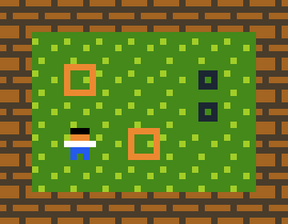

# Entity Component System

In this section we will discuss Sokoban in more detail and how we will architect our game.

## Sokoban
Here is how a Sokoban game looks like, if you are not familiar with the gameplay already. We have walls and boxes, and the goal is for the player to move the boxes onto their spots by pushing them around.



## ECS
ECS (Entity Component System) is an architectural pattern for writing games which follows the composition over inheritance principle. We will be using ECS heavily in this project, much like most Rust games, so let's spend a bit of time familiarizing ourselves with the key concepts:
* **Components** - data-only structs which hold different characteristics of entities: some examples of components: Position, Renderable, Movement, etc. The key part here is that this is pure data, no behaviour.
* **Entities** - entities are made up of multiple components, for example a player might be made up by Position, Renderable & Movement, while the floor might just be Position & Renderable since it doesn't move. Entities are pretty much just dummy containers of one or more components with a unique identifier.
* **Systems** - systems use entities and components and contain behaviour and logic based on that data. For example, you could have a rendering system which just iterates through all entities which contain renderable components and draws all of them. The key here is that the components themselves don't contain any behaviour, instead they use a system to interpret the data and act.

If that doesn't make sense yet don't worry, we will discuss some practical examples in the next section applied to our Sokoban game.


## Sokoban architecture
Based on what we know now about how a Sokoban game should work, we will need a few different types of "things": walls, a player, floors, boxes and box spots. These will be our *entities*.

Now we have to identify what these entities will be made of, or what *components* we need. Well first of all we will need to keep track of where everything is on the map, so we need some sort of position component. Secondly, some (but not all) entities can move. The player can move around, but boxes can also move if they get pushed by the player. Finally, we need a way to render each entity, so we need some renderable component.

Here is how our first idea of entities and components looks like:
1. **Player entity**: Position, Renderable, Movable
1. **Wall entity**: Position, Renderable
1. **Floor entity**: Position, Renderable
1. **Box entity**: Position, Renderable, Movable
1. **Box spot entity**: Position, Renderable

At first thinking in ECS might be difficult, so don't worry if you don't understand everything yet or if this doesn't seem familiar with the way you've done things in other languages.

## Specs
Finally, let's bring in an ECS crate. There are a ton of them out there, but we will use [specs](https://specs.amethyst.rs/docs/tutorials/) for this book.

```
{{#include ../../../code/rust-sokoban-c01-03/Cargo.toml:9:11}}
```

Next up, we'll start implementing entities and components!

> **_CODELINK:_**  You can see the full code in this example [here](https://github.com/iolivia/rust-sokoban/tree/master/code/rust-sokoban-c01-03).
