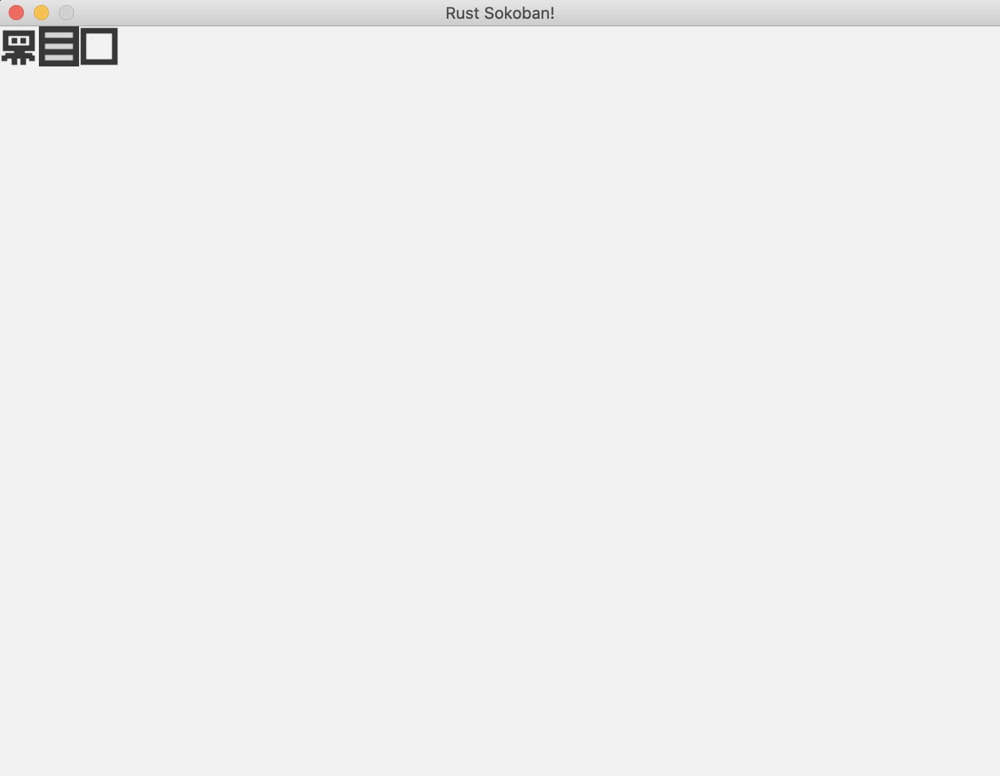

# Rendering system

It's time for our first system, the rendering system. This system will be responsible for drawing all our entities on the screen.

## Rendering system setup
First we'll define the `RenderingSystem` struct, it will need access to the ggez context in order to actually render.

```rust
{{#include ../../../code/rust-sokoban-c01-04/src/main.rs:47:49}}
```

We've got some new syntax here; `'a` is called a lifetime annotation. It's needed because the compiler can't see how long the reference in `RenderingSystem` is valid, meaning that we have to specify the lifetime annotation.

> **_MORE:_**  Read more about lifetimes [here](https://doc.rust-lang.org/book/ch10-03-lifetime-syntax.html).

Now let's implement the System trait for our Rendering system. This doesn't do anything yet, we're just setting up the scaffolding. The definition of SystemData means that we will have access to the storage of position and renderable components, and the fact that it's read storage means we only get immutable access, which is exactly what we need.

```rust
{{#include ../../../code/rust-sokoban-c01-04/src/main.rs:51:57}}
        // implementation here
{{#include ../../../code/rust-sokoban-c01-04/src/main.rs:83:84}}
```

Finally let's run the rendering system in our draw loop. This means that every time the game updates we will render the latest state of all our entities.

```rust
{{#include ../../../code/rust-sokoban-c01-04/src/main.rs:97:111}}
```

Running the game now should compile, but it will probably not do anything yet, since we haven't filled in any of the implementation of the rendering system and also we haven't created any entities.

## Rendering system implementation

Here is the implementation of the rendering system. It does a few things:
* clear the screen (ensuring we don't keep any of the state rendered on the previous frame)
* get all entities with a renderable component and sort them by z (we do this in order to ensure we can render things on top of each other, for example the player should be above the floor, otherwise we wouldn't be able to see them)
* iterate through sorted entities and render each of them as an image
* finally, present to the screen

```rust
{{#include ../../../code/rust-sokoban-c01-04/src/main.rs:56:83}}
```

## Add some test entities

Let's create some test entities to make sure things are working correctly.

```rust
{{#include ../../../code/rust-sokoban-c01-04/src/main.rs:179:204}}
```

Finally, let's put everything together and run. You should see something like this! This is super exciting, now we have a proper rendering system and we can actually see something on the screen for the first time. Next up, we're going to work on the gameplay so it can actually feel like a game!



Final code below.

> **_NOTE:_**  Note that this is a very basic implementation of rendering and as the number of entities grow the performance will not be good enough. A more advanced implementation of rendering which uses batch rendering can be found in [Chapter 3 - Batch Rendering](/c03-04-batch-rendering.html).


```rust
{{#include ../../../code/rust-sokoban-c01-04/src/main.rs}}
```

> **_CODELINK:_**  You can see the full code in this example [here](https://github.com/iolivia/rust-sokoban/tree/master/code/rust-sokoban-c01-04).