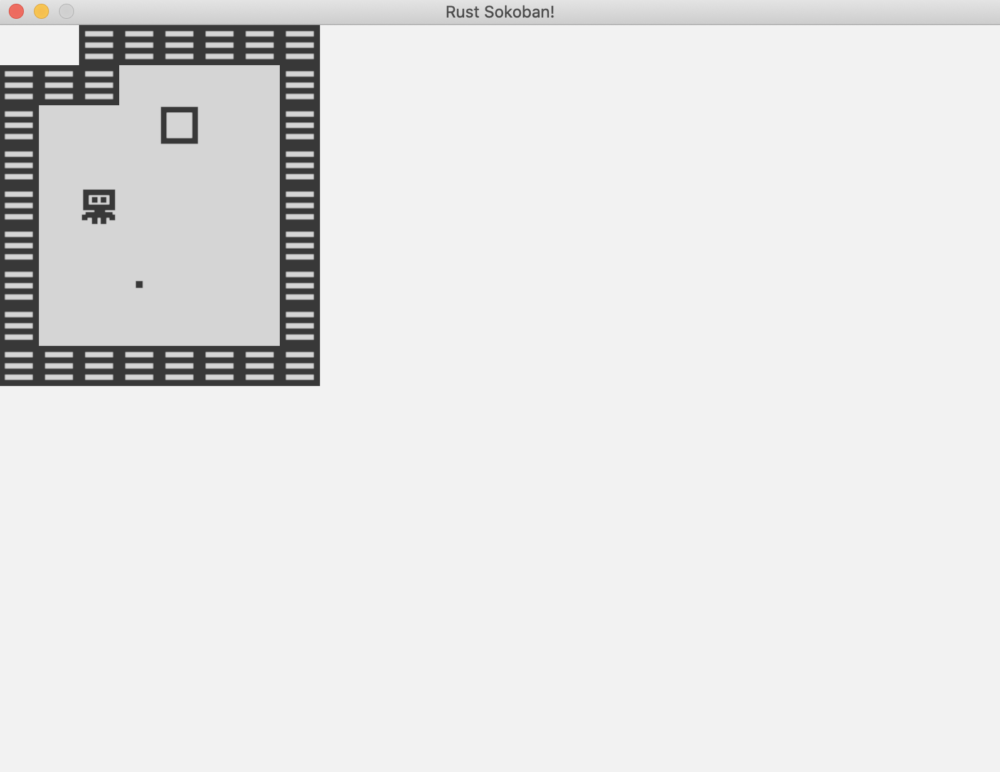

# Carga del mapa

En el anterior capítulo concluímos con la creación de algunas entidades para probar nuestro sistema de renderizado, ahora es momento de renderizar el mapa. En esta sección crearemos
la configuración del mapa cargándola desde un texto.

## Configuración del mapa
Primer paso, intentemos cargar un nivel con base en un mapa 2d que luce como este.

```
{{#include ../../../code/rust-sokoban-c02-01/src/main.rs:181:189}}

donde:
. es un espacio libre
W es una pared (Wall)
P es el jugador (Player)
B es una caja (Box)
S es un espacio para una caja (box Spot)
N es nada: se usa para los puntos fuera del mapa
```

Colocaremos la información del mapa en una cadena de texto, eventualmente la podemos cargar desde un archivo pero por ahora utilizaremos una constante por simplicidad.

```rust
{{#include ../../../code/rust-sokoban-c02-01/src/main.rs:179:193}}
```

Y aquí tenemos la implementación de carga del mapa.

```rust
{{#include ../../../code/rust-sokoban-c02-01/src/main.rs:195:234}}
```

El concepto más interesante de Rust en este código probablemente es `match`. Aquí estamos utilizando la característica básica de coincidencia de patrones, simplemente buscamos la coincidencia de valores de cada elemento que se encuentra en la configuración del mapa, pero podríamos tener condiciones más avanzadas o más tipos de patrones.

> **_MORE:_**  Lee más sobre coincidencia de patrones [aquí](https://doc.rust-lang.org/book/ch06-02-match.html).

Ahora ejecutemos el juego y veamos cómo luce nuestro mapa.



A continuación tenemos el código final

```rust
{{#include ../../../code/rust-sokoban-c02-01/src/main.rs}}
```

> **_CODELINK:_**  Puedes ver el código completo de este ejemplo [aquí](https://github.com/iolivia/rust-sokoban/tree/master/code/rust-sokoban-c02-01).
