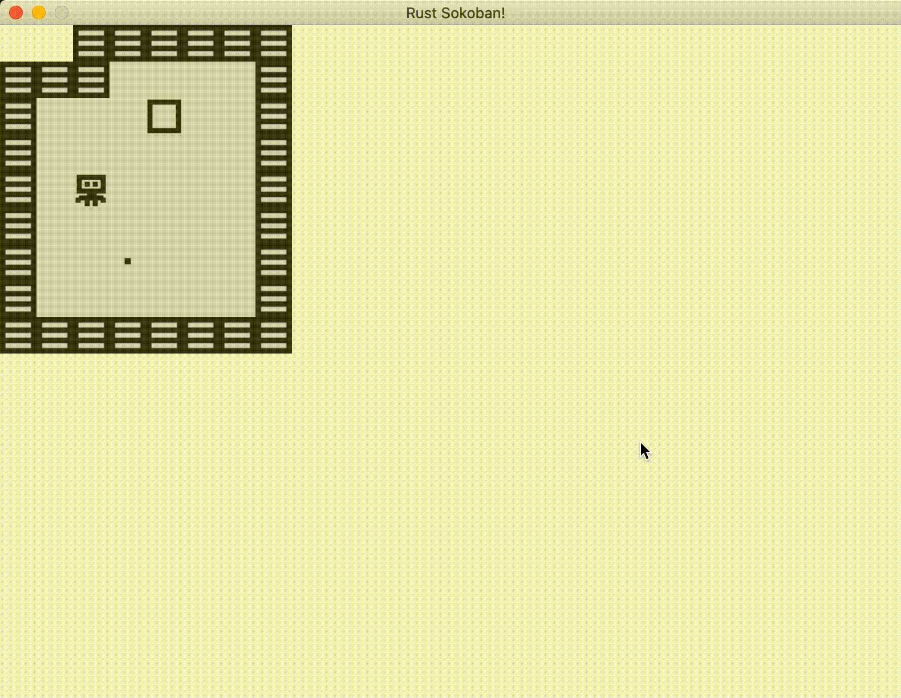

# Moviendo al jugador

No podemos tener un juego si no es posible mover al jugador, ¿o si? En esta sección veremos cómo capturar los eventos de entrada.

## Eventos de entrada
El primer paso para hacer que nuestro jugador se mueva es escuchar los eventos de entrada. Si damos un vistazo rápido al [ejemplo de entrada de ggez](https://github.com/ggez/ggez/blob/master/examples/input_test.rs#L59) podemos ver que nos podemos suscribir a todo tipo de eventos relacionados con el ratón y el teclado, por ahora solo queremos el evento de pulsación del teclado `key_down_event`.

Empecemos por escuchar los eventos de teclado. Primero importaremos algunos módulos adicionales:

```rust
{{#include ../../../code/rust-sokoban-c02-02/src/main.rs:1:11}}
```

Ahora, agregaremos el código siguiente dentro del bloque de implementación de `event::EventHandler` de nuestra estructura Game:

```rust
{{#include ../../../code/rust-sokoban-c02-02/src/main.rs:134}}

    // ...

{{#include ../../../code/rust-sokoban-c02-02/src/main.rs:155:162}}
{{#include ../../../code/rust-sokoban-c02-02/src/main.rs:166}}

    // ...

{{#include ../../../code/rust-sokoban-c02-02/src/main.rs:167}}
```

Si ejecutamos el código anterior deberíamos ver las siguientes líneas impresas en la consola.

```
Key pressed: Left
Key pressed: Left
Key pressed: Right
Key pressed: Up
Key pressed: Down
Key pressed: Left
```

Si no estás familiarizado con la notación `{:?}` utilizada al imprimir, se trata de una manera conveniente en la que Rust nos permite imprimir objetos para depurar. En este caso imprimimos un objeto KeyCode (que es un enum) porque el tipo KeyCode implementa el trait Debug utilizando la macro Debug (recuerda que comentamos sobre las macros en el [Capítulo 1.3](./c01-03-entities-components.html), puedes revisarlo nuevamente si necesitas un repaso). Si KeyCode no implementara Debug no podríamos utilizar esta sintaxis y en su lugar obtendríamos un error del compilador. Esto nos ahorra el tener que escribir código adicional para convertir los códigos de teclas a textos, podemos confiar en la funcionalidad ya construída para ello.

## Recursos
A continuación agregaremos un recurso, que es la forma como specs comparte información de estado a través de los sistemas que no forman parte del mundo. Utilizaremos un recurso para modelar la cola de entrada de teclas presionadas, ya que esta no encaja dentro de nuestro modelo de componentes/entidades.

```rust
{{#include ../../../code/rust-sokoban-c02-02/src/main.rs:48:52}}
```

Y entonces moveremos las nuevas teclas presionadas dentro de la cola cuando se llama al evento `key_down_event`.

```rust
{{#include ../../../code/rust-sokoban-c02-02/src/main.rs:134}}

    // ...

{{#include ../../../code/rust-sokoban-c02-02/src/main.rs:155:166}}

    // ...

{{#include ../../../code/rust-sokoban-c02-02/src/main.rs:167}}
```

Finalmente, necesitamos registrar los recursos con specs como lo hicimos con los componentes.

```rust
// Registrando recursos
{{#include ../../../code/rust-sokoban-c02-02/src/main.rs:179:181}}

// Registrando recursos en main
{{#include ../../../code/rust-sokoban-c02-02/src/main.rs:295:312}}
```

## Sistema de entrada

Utilizando el siguiente código tenemos un recurso que es una cola continua de eventos de entrada de teclado. A continuación, empezaremos a procesar estas entradas en un sistema.

```rust
{{#include ../../../code/rust-sokoban-c02-02/src/main.rs:94:121}}
```

Finalmente necesitamos ejecutar el sistema dentro de nuestro ciclo de actualización.

```rust
{{#include ../../../code/rust-sokoban-c02-02/src/main.rs:135:143}}
```

El sistema de entrada es bastante simple, toma todos los jugadores y posiciones (deberíamos tener solo un jugador pero todavía no necesitamos preocuparnos por ello, en teoría podría funcionar si tuviéramos varios jugadores que quisiéramos controlar con el mismo tipo de entrada). Y luego para cada combinación de jugador y posición, tomará la primera tecla presionada y la removerá de la cola de entrada. Entonces tiene que determinar cuál es la transformación requerida - por ejemplo, si presionamos la tecla arriba significa que queremos mover una casilla hacia arriba, y luego aplica esta actualización de posición.

¡Genial! Así es como debería verse. Nota que podemos atravesar las paredes y las cajas. Lo arreglaremos en la siguiente sección cuando agreguemos el componente Movable.



> **_CODELINK:_**  Puedes ver el código completo de este ejemplo [aquí](https://github.com/iolivia/rust-sokoban/tree/master/code/rust-sokoban-c02-02).