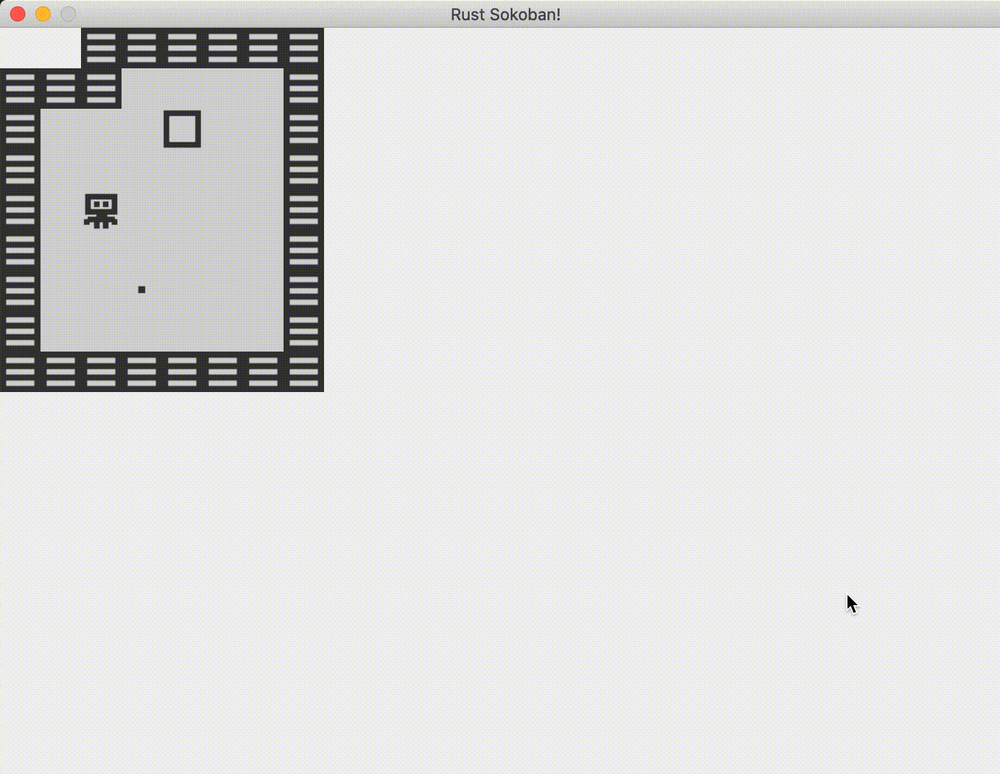

# Empujando cajas

En el capítulo anterior logramos que el jugador se moviera, pero puede atravesar las paredes y las cajas, sin realmente interactuar con el ambiente. En esta sección agregaremos la lógica para que el movimiento del jugador sea más inteligente.

## Componentes de movimiento
En primer lugar, necesitamos hacer nuestro código un tanto más genérico. Si recuerdas en el capítulo anterior estábamos operando sobre los jugadores para averiguar si deberíamos moverlos, pero también necesitamos mover las cajas. También en el futuro podríamos querer introducir algún otro tipo de objeto que pudiera contar con movimiento, así que intentaremos construir algo con todo lo anterior en mente. Lo que haremos siguiendo el espíritu de un sistema ECS será utilizar un componente marcador que nos indique qué entidades son movibles y cuáles no. Por ejemplo, los jugadores y las cajas son movibles, mientras que las paredes son inamovibles. Los lugares designados para las cajas de cierta forma no son relevantes aquí porque no se mueven, pero tampoco deberían afectar el movimiento de los jugadores o de las cajas, así que los lugares designados para las cajas no tendrán ninguno de los componentes que acabamos de mencionar.

A continuación tenemos nuestros dos nuevos componentes, nada demasiado novedoso además de dos pequeños detalles:
* estamos usando `NullStorage` que es un poco más eficiente que utilizar `VecStorage` ya que estos dos componentes no tendrán ningún atributo, y solo se utilizan como marcadores
* estamos implementando Default porque es un requisito para utilizar NullStorage
* agregando los dos componentes nuevos a nuestra función register_components


```rust
{{#include ../../../code/rust-sokoban-c02-03/src/main.rs:55:62}}

{{#include ../../../code/rust-sokoban-c02-03/src/main.rs:250:259}}
```

A continuación, agregaremos:
* with(Movable) a los jugadores y a las cajas
* with(Inmovable) a las paredes
* no haremos nada con el piso y los lugares designados para las cajas (como se mencionó antes no deberían formar parte de nuestro sistema de movimiento/colisión ya que no afectan en nada al movimiento)


```rust
{{#include ../../../code/rust-sokoban-c02-03/src/main.rs:266:321}}
```

## Requerimientos de movimiento
Pensemos algunos ejemplos que ilustren nuestros requerimientos para el movimiento. Esto nos ayudará a entender cómo necesitamos cambiar la implementación del sistema de entrada para utilizar `Movable` e `Inmovable` correctamente.

Escenarios:
1. `(jugador, piso)` y se presionó la tecla `DERECHA` -> el jugador debería moverse a la derecha
1. `(jugador, pared)` y se presionó `DERECHA` -> el jugador no debe moverse a la derecha
1. `(jugador, caja, piso)` y se presionó `DERECHA` -> el jugador debe moverse a la derecha, la caja debe moverse a la derecha
1. `(jugador, caja, pared)` y se presionó `DERECHA` -> nada debería moverse
1. `(jugador, caja, caja, piso)` y se presionó `DERECHA` -> el jugador, la caja1 y la caja 2 deberían todos moverse hacia la derecha
1. `(jugador, caja, caja, pared)` y se presionó `DERECHA` -> nada debería movesrse

Algunas observaciones que podemos hacer basándonos en lo anterior:
* la detección de colisión/movimiento debería ocurrir al mismo tiempo para todos los objetos involucrados - por ejemplo, para el escenario 6 si procesáramos un elemento a la vez, moveríamos al jugador, moveríamos la primera caja y cuando moviéramos la segunda nos daríamos cuenta de que no podemos hacerlo, y tendríamos que revertir todas nuestras acciones de movimiento, lo cual no funcionaría. Así que para cada entrada que recibamos, debemos determinar a todos los objetos que se deba involucrar y decidir holísticamente si la acción es posible o no.
* una cadena de objetos movibles con un espacio vacío pueden moverse (un espacio vacío en este caso significa ni movible ni inamovible)
* una cadena de objetos movibles con un punto inamovible no se pueden mover
* aunque en todos los ejemplos el movimiento es hacia la derecha, las reglas deberían generalizarse para cualquier movimiento y la tecla presionada debería influenciar solo cómo encontramos la cadena

Así que dado lo anterior, empecemos a implementar esta lógica. Pensemos acerca de las piezas lógicas que necesitamos. Algunas ideas iniciales:
1. **encontrar todos las entidades movibles e inamovibles** - esto para que podamos determinar si son afectadas por el movimiento
2. **determinar de qué forma moverse con base en la tecla** - ya hemos determinado esto en la sección anterior, basicamente un conjunto de operaciones +1/-1 basadas en el enum que representa la tecla
3. **iterar todas las posiciones entre el jugador y el fin del mapa** en el eje correcto con base en la dirección - por ejemplo, si presionamos la techa derecha, necesitamos ir de la posición x del jugador (player.x) hacia el ancho del mapa (map_width), si presionamos arriba debemos ir de 0 a la posición y del jugador (player.y)
4. **por cada casilla en esta secuencia** necesitamos:
    * si la casilla es movible, continuar y tener presente esta casilla
    * si la casilla es inamovible, detener y no mover nada
    * si la casilla no es movible ni inamovible, mover todas las casillas que tenemos presentes hasta el momento

A continuación se tiene la nueva implementación de los sistemas de entrada, es un poco larga pero ojalá te haga sentido.

```rust
{{#include ../../../code/rust-sokoban-c02-03/src/main.rs:113:197}}
```

Ahora si ejecutamos el código, ¡veremos que realmente funciona! Ya no podemos atravesar paredes y podemos empujar la caja, y esta se detiene cuando llega a la pared.



El código completo se encuentra a continuación.

```rust
{{#include ../../../code/rust-sokoban-c02-03/src/main.rs}}
```

> **_CODELINK:_**  Puedes ver el código completo de este ejemplo [aquí](https://github.com/iolivia/rust-sokoban/tree/master/code/rust-sokoban-c02-03).