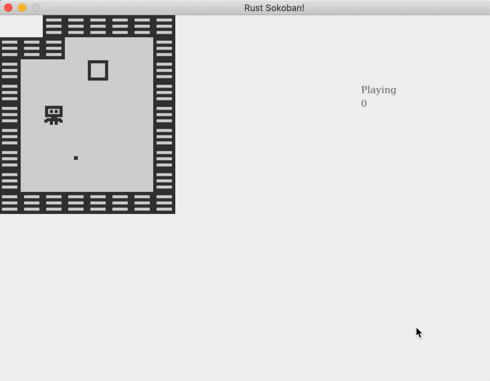

# Gameplay

The player character is able to move and push boxes on the field. Many (but not all!) games have some kind of objective
for the player to achieve.  The objective for Sokoban-style games is typically to push boxes onto a goal spot.  There's
nothing stopping the player from doing this now, but the game also isn't checking for success.  The player might achieve
the objective without realizing it!  Let's update the game to check for the success state.

Let's think about what we'll need to add to this game to check for the success condition and to notify the user
when they've beaten the level:

- A `resource` for tracking the game state
    - Is the game in progress or completed?
    - How many move has the player made?
- A `system` for checking if the user has completed their objective
- A `system` for updating the number of moves made
- UI for reporting game state

## Gameplay Resource

We're choosing to use a `resource` to track game state because the game state is
not associated with a specific entity. Let's start by defining a `Gameplay` resource.

```rust
// resources.rs
{{#include ../../../code/rust-sokoban-c02-05/src/resources.rs:38:43}}
```

`Gameplay` has two fields: `state` and `moves_count`. These are used to track the
current state of the game (is the game still in play, or has the player won?) and
the number of moves made.  `state` is described by an `enum`, defined like so:

```rust
// resources.rs
{{#include ../../../code/rust-sokoban-c02-05/src/resources.rs:17:20}}
```

The eagle-eyed reader will note that we used a macro to derive the `Default` trait
for `Gameplay`, but not for the `GameplayState` enum. If we want to use `Gameplay`
as a resource, it must implement `Default`.

So, what will we do? Since Rust macros can't derive `Default` for enums
automatically, we must implement `Default` for `Gameplay` ourselves.

```rust
// resources.rs
{{#include ../../../code/rust-sokoban-c02-05/src/resources.rs:32:36}}
```

Having defined the resource, let's register it with the world:

```rust
// resources.rs
{{#include ../../../code/rust-sokoban-c02-05/src/resources.rs:12:15}}
```

Now, when the game is started, the `Gameplay` resource will look like this:

```rust
Gameplay {
    state: GameplayState::Playing,
    moves_count: 0
}
```

## Step Counter System

We can increment `Gameplay`'s `moves_count` field to track the number of turns taken.
We already have a system dealing with user input in `InputSystem`, so let's adapt that for this purpose.

Since we need to mutate the `Gameplay` resource, we need to register it with
`InputSystem` by adding `Write<'a, Gameplay>` to the `SystemData` type
definition.

```rust
// input_system.rs
{{#include ../../../code/rust-sokoban-c02-05/src/systems/input_system.rs:0:25}}
        ...
```

Since we've already done the work to check if a player character will move in
response to a keypress, we can use that to determine when to increment the step
counter.

```rust
// input_system.rs
        ...
{{#include ../../../code/rust-sokoban-c02-05/src/systems/input_system.rs:83:105}}
```

## Gameplay System

Next, let's integrate this resource with a new `GamePlayStateSystem`.  This
system will continuously check to see if all the boxes have the same
position as all the box spots. Once all the boxes are on all the box spots,
the game has been won!

Aside from `Gameplay`, this system only needs read-only access to the
`Position`, `Box`, and `BoxSpot` storages.

The system uses `Join` to create a vector from the `Box` and `Position`
storages.  This vector is mapped into a hashmap containing the location of
each box on the board.

Next, the system uses the `Join` method again to create an iterable from
entities that have both `BoxSpot` and `Position` components.  The system walks through this iterable.
If all box spots have a corresponding box at the same position, the game is over and the player has won.
Otherwise, the game is still in play.

```rust
// gameplay_state_system.rs
{{#include ../../../code/rust-sokoban-c02-05/src/systems/gameplay_state_system.rs::}}
```

Finally, let's run the gameplay system in our main update loop.

```rust
// main.rs
{{#include ../../../code/rust-sokoban-c02-05/src/main.rs:24:39}}
    // ...
{{#include ../../../code/rust-sokoban-c02-05/src/main.rs:63}}
```


## Gameplay UI

The last step is to provide feedback to the user letting them know what the
state of the game is.  This requires a resource to track the state and a
system to update the state. We can adapt the `GameplayState` resource and
`RenderingSystem` for this.

First, we'll implement `Display` for `GameplayState` so we can render the
state of the game as text. We'll use a match expression to allow `GameplayState`
to render "Playing" or "Won".

```rust
// resources.rs
{{#include ../../../code/rust-sokoban-c02-05/src/resources.rs:21:30}}
```

Next, we'll add a `draw_text` method to `RenderingSystem`, so it can print
`GameplayState` to the screen...

```rust
// rendering_systems.rs
{{#include ../../../code/rust-sokoban-c02-05/src/systems/rendering_system.rs:16:32}}
```

...and then we'll add the `Gameplay` resource to `RenderingSystem` so we can
call `draw_text`.  `RenderingSystem` needs to be able to read the `Gameplay`
resource.

```rust
// rendering_system.rs
{{#include ../../../code/rust-sokoban-c02-05/src/systems/rendering_system.rs:35:71}}
```

At this point, the game will provide basic feedback to the user:
- Counts the number of steps
- Tells the player when they have won

Here's how it looks.




There are plenty of other enhancements that can be made!

> **_CODELINK:_**  You can see the full code in this example [here](https://github.com/iolivia/rust-sokoban/tree/master/code/rust-sokoban-c02-05).