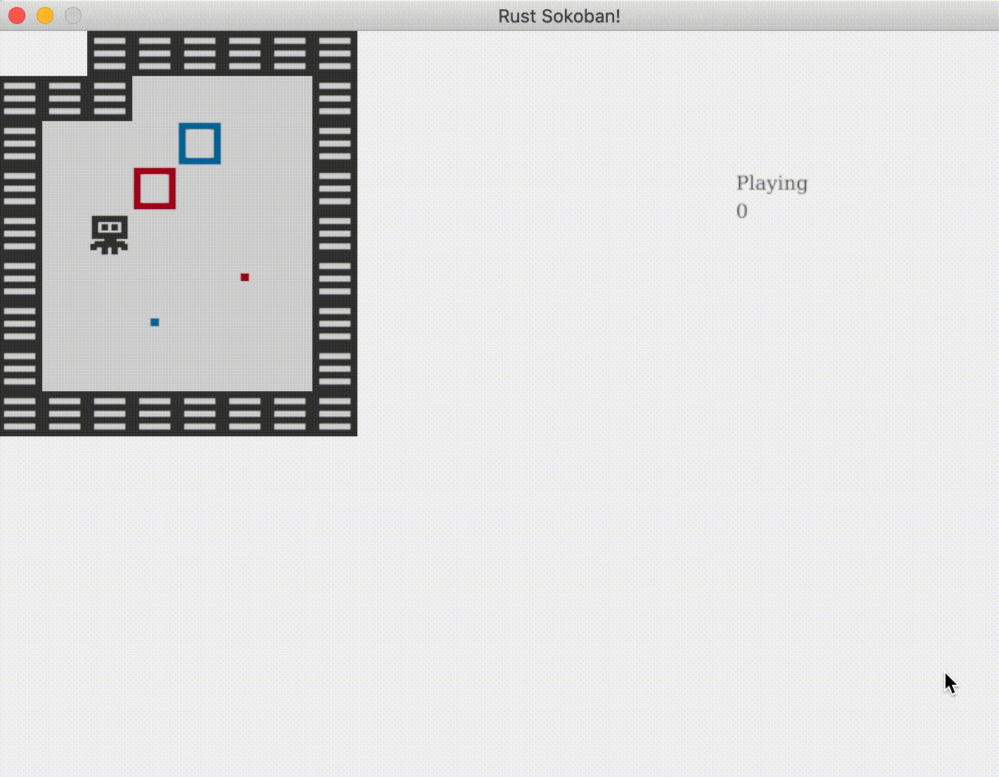

# Cajas de colores
¡Es momento de que agreguemos un poco de estilo a nuestro juego! La jugabilidad hasta el momento es bastante sencilla, colocar la caja en el lugar especificado. Hagamos esto un poco más interesante agregando cajas de diferentes colores. Utilizaremos rojo y azul por ahora pero siéntete libre de adaptarlo a tu preferencia, ¡y crear más colores! Ahora deberás colocar la caja en el destino del mismo color.

## Recursos
Primero agreguemos los nuevos recursos, clic derecho y descarga estas imágenes, ¡o crea las propias!


La estructura de carpetas debería lucir así (nota que hemos eliminado la caja y meta anteriores).

```
├── resources
│   └── images
│       ├── box_blue.png
│       ├── box_red.png
│       ├── box_spot_blue.png
│       ├── box_spot_red.png
│       ├── floor.png
│       ├── player.png
│       └── wall.png
├── src
│   ├── systems
│   │   ├── gameplay_state_system.rs
│   │   ├── input_system.rs
│   │   ├── mod.rs
│   │   └── rendering_system.rs
│   ├── components.rs
│   ├── constants.rs
│   ├── entities.rs
│   ├── main.rs
│   ├── map.rs
│   └── resources.rs
├── Cargo.lock
├── Cargo.toml
```

## Cambios a los componentes
Ahora agreguemos un enum para el color (si elegiste implementar más de dos colores deberás agregarlos aquí).

```rust
// components.rs
{{#include ../../../code/rust-sokoban-c03-01/src/components.rs:29:32}}
```

Ahora utilicemos este enum tanto para la caja como para la meta.

```rust
// components.rs
{{#include ../../../code/rust-sokoban-c03-01/src/components.rs:44:54}}
```

## Creación de entidades
Agreguemos también el color como un parámetro cuando creamos las cajas y las metas, asegurándonos de pasar la ruta correcta al recurso con base en el enum de color.

Para crear la cadena de texto correcta para la ruta del recurso básicamente queremos `"/images/box_{}.png"` donde `{}` es el color de la caja que estamos creando. El reto que ahora tenemos es que estamos utilizando un enum para el color, por lo que el compilador de Rust no sabrá covertir `BoxColour::Red` a `"red"`. Sería genial que se pudiera hacer `colour.to_string()` y obtener el valor correcto. Afortunadamente, Rust tiene una buena manera para que hagamos esto, necesitamos implementar el trait `Display` en el enum `BoxColour`. A continuación tienes cómo luce, simplemente especificamos cómo relacionar cada variante del enum con una cadena de texto.

```rust
// components.rs
{{#include ../../../code/rust-sokoban-c03-01/src/components.rs:34:43}}
```

Ahora incluyamos el color en nuestro código de creación de la entidad y usemos el elegante `colour.to_string()` que recién hicimos posible en el anterior trozo de código.

```rust
// entities.rs
{{#include ../../../code/rust-sokoban-c03-01/src/entities.rs:27:48}}
```

## Mapa
Ahora cambiemos nuestro código del mapa para permitir nuevas opciones para cajas de colores y metas:
* "BB" para caja azul
* "RB" para caja roja
* "BS" para meta azul
* "RS" para meta roja

```rust
// map.rs
{{#include ../../../code/rust-sokoban-c03-01/src/map.rs}}
```

Y actualicemos nuestro mapa estático en main.

```rust
// main.rs
{{#include ../../../code/rust-sokoban-c03-01/src/main.rs:65:80}}
```

## Jugabilidad
Ya hemos hecho el trabajo difíci, así que ahora podemos continuar y probar nuestro código. Notarás que todo funciona, pero hay un gran bug en la jugabilidad. Puedes ganar colocando la caja roja en la meta azul y viceversa. Arreglémoslo.

Antes aprendimos que los datos van en los componentes y el comportamiento en los sistemas - siguiendo la metodología ECS. Lo que ahora discutimos es comportamiento, así que debe ir en un sistema. ¿Recuerdas que agregamos un sistema para validar si se había ganado o no? Pues bien, ese es el lugar exacto que buscamos.

Modifiquemos la función run y validemos si el color de la meta y de la caja coinciden.

```rust
// gameplay_state_system.rs
{{#include ../../../code/rust-sokoban-c03-01/src/systems/gameplay_state_system.rs:20:52}}
```

Si compilas el código en este punto debería quejarse del hecho de que estamos intentando comparar dos enums con `==`. Rust no sabe por defecto cómo manejar esto, así que debemos indicárselo. La mejor forma en la que podemos hacerlo es agregar una implementación del trait `PartialEq`.

```rust
// components.rs
{{#include ../../../code/rust-sokoban-c03-01/src/components.rs:28:32}}
```

Ahora es un buen momento para comentar sobre las inusuales anotaciones `derive`. Las hemos utilizado antes, pero no profundizamos sobre lo que hacen. Los atributos derive pueden aplicarse a structs o enums y nos permiten agregar implementaciones por defecto de algún trait a nuestros tipos. Por ejemplo aquí le estamos indicando a Rust que agregue la implementación por defecto del trait `PartialEq` a nuestro enum `BoxColour`.

A continuación vemos cómo luce la implementación por defecto de `PartialEq`, checa si algo es igual a si mismo. Si es así, la comparación es exitosa y si no, ésta falla. No te preocupes demasiado si no te hace sentido.

```rust
pub trait PartialEq {
  fn eq(&self, other: &Self) -> bool;
  fn ne(&self, other: &Self) -> bool { !self.eq(other) };
}
```

Así que al agregar `#[derive(PartialEq)]` en la parte superior del enum le indicamos a Rust que `BoxColour` ahora implementa el trait de igualdad parcial que vimos antes, lo que significa que si intentamos hacer `box_colour_1 == box_colour_2` se utilizará esta implementación que validará si el objeto box_colour_1 es el mismo que el objeto box_colour_2. Esta no es la implementación más sofisticada de igualdad parcial, pero debiera funcionar bien para nuestro caso de uso.

> **_MORE:_**  Lee más sobre PartialEq [aquí](https://doc.rust-lang.org/std/cmp/trait.PartialEq.html) y más sobre traits derivables [aquí](https://doc.rust-lang.org/book/appendix-03-derivable-traits.html).

¡Ahora podemos compilar el código y cosechar las recompensas de nuestros esfuerzos, viendo el juego correr e indicándonos que hemos ganado solo cuando colocamos la caja correcta en la meta correcta¡



> **_CODELINK:_**  Puedes ver el código fuente completo de este ejemplo [aquí](https://github.com/iolivia/rust-sokoban/tree/master/code/rust-sokoban-c03-01).