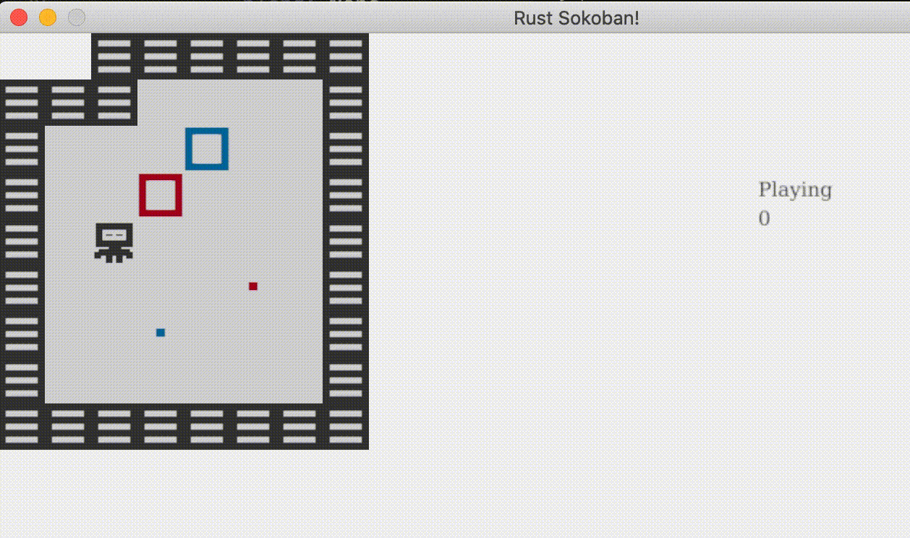

# Animations
In this section we are going to look at adding animations to our game, we'll start with some basic ones but feel free to add more complex ones given the ideas in this tutorial. We'll add two animations: making the player blink and making the boxes jiggle slightly in place. 

## What is an animation?
An animation is simply a set of frames played at a specific time interval that gives the illusion of movement. Think of it like a video (a video is just a set of images played in sequence), but much lower framerate. 

For example, to get our player blinking we'll have three animation frames: 
1. our current player with the eyes open
1. player with eyes a little bit closed
1. player with eyes completely closed

If we play these three frames in sequence you'll notice it looks like the player is blinking. You can try this out by opening the images and shifting between them quickly on the image preview. 

There are a few gotchas on this: 
* the assets need to be done with a specific framerate in mind - for us we will go with 250 milliseconds, meaning we will play a new animation frame every 250ms, so we will have 4 frames per second
* the assets need to be consistent with each other - imagine we had two types of players which had different assets and different looking eyes, we would have to make sure that when we create the three frames mentioned above they would be consistent, otherwise the two players would blink at different rates
* designing assets for a lot of frames is a lot of work, so we'll try to keep our animations quite simple and stick to the key frames

## How will it work?
So how is this going to work in our existing Sokoban game? We'll have to:
1. Change our renderable component to allow multiple frames - we could also create a new renderable component that handles animated renderables and keep the one we have for static renderables, but it feels a bit cleaner to keep them together for now
1. Modify the player entity construction to take multiple frames
1. Keep track of time in our rendering loop - we'll discuss this one in more detail so don't worry if it's not obvious why we need to do this
1. Change the rendering system taking into account the number of frames, the time and the frame that is supposed to be rendered at a given time

## Assets
Let's add the new assets for the player, it should then look like this. Notice we created a convention to name the frames sequentially, this is not strictly necessary, but it will help us keep track of the order easily.


```
├── resources
│   └── images
│       ├── box_blue.png
│       ├── box_red.png
│       ├── box_spot_blue.png
│       ├── box_spot_red.png
│       ├── floor.png
│       ├── player_1.png
│       ├── player_2.png
│       ├── player_3.png
│       └── wall.png
```

## Renderable
Now let's update our renderable component to receive multiple frames, instead of having a single path, we'll have a list of paths, this should be pretty straightforward. 

Let's also add two new functions to construct the two types of renderables, either with a single path or with multiple paths. These two functions are associated functions, because they are associated with the struct `Renderable`, but they are the equivalent of static functions in other languages since they don't operate on instances (notice they don't receive `&self` or `&mut self` as the first argument, which means we can call them in the context of the struct not an instance of the struct). They are also similar to factory functions, since they encapsulate the logic and validation required before actually constructing an object.

> **_MORE:_**  Read more about associated functions [here](https://doc.rust-lang.org/book/ch05-03-method-syntax.html#associated-functions).

```rust
// components.rs
{{#include ../../../code/rust-sokoban-c03-02/src/components.rs:19:32}}
{{#include ../../../code/rust-sokoban-c03-02/src/components.rs:48}}
```

Next, we need a way of telling if a renderable is animated or static, which we will use in the rendering system. We could leave the paths member variable public and allow the rendering system to get the length of the paths and infer based on the length, but there is a more idiomatic way. We can add an enum for the kind of renderable, and add a method on the renderable to get that kind, in this way we encapsulate the logic of the kind within the renderable, and we can keep paths private. You can put the kind declaration anywhere in the components.rs, but ideally next to the renderable declaration.

```rust
// components.rs
{{#include ../../../code/rust-sokoban-c03-02/src/components.rs:14:18}}
```

Now let's add a function to tell us the kind of a renderable based on the internal paths.

```rust
// components.rs
{{#include ../../../code/rust-sokoban-c03-02/src/components.rs:25:40}}
{{#include ../../../code/rust-sokoban-c03-02/src/components.rs:48}}
```

And finally, because we made paths private, we need to allow users of renderable to get a specific path from our list. For static renderables, this will be the 0th path (the only one) and for animated paths we'll let the rendering system decide which path should be rendered based on the time. The only tricky bit here is if we get asked for a frame bigger than what we have, we will wrap that around by modding with the length. 

```rust
// components.rs
{{#include ../../../code/rust-sokoban-c03-02/src/components.rs:25}}

    //...

{{#include ../../../code/rust-sokoban-c03-02/src/components.rs:42:48}}
```

## Entity creation
Next up, let's update our player entity creation to account for multiple paths. Notice now we are using the `new_animated` function to construct the renderable.

```rust
// entities.rs
{{#include ../../../code/rust-sokoban-c03-02/src/entities.rs:48:60}}
```

And let's update everything else to use the `new_static` function - here is how we are doing it for the wall entity creation, feel free to go ahead and apply this to the other static entities.

```rust
// entities.rs
{{#include ../../../code/rust-sokoban-c03-02/src/entities.rs:5:14}}
```

## Time
Another component we will need for this is keeping track of time. What does time have to do with this and how does this connect with frame rate? The basic idea is this: ggez controls how often the rendering system gets called, and this depends on the frame rate which in turn depends on how much work we are doing on every iteration of the game loop. Because we don't control this, in the span of a second we could get called 60 times or 57 times or maybe even 30 times. This means we cannot base our animation system on the framerate, and instead we need to keep it based on time. 

Because of this we need to keep track of the delta time - or how much time passes between the previous loop and the current loop. And because the delta time is much smaller than our animation frame interval (which we have decided on 250ms), we need to keep the cumulative delta - or how much time has passed since the beginning of the game being launched.

> **_MORE:_**  Read more about delta time, frame rate and game loops [here](https://medium.com/@dr3wc/understanding-delta-time-b53bf4781a03#:~:text=Delta%20time%20describes%20the%20time,drawn%20and%20the%20current%20frame.&text=If%20you%20read%20my%20article,until%20the%20game%20is%20stopped.), [here](https://www.reddit.com/r/pcmasterrace/comments/29qcqr/an_explanation_of_game_loops_fps_and_delta_time/) or [here](https://www.youtube.com/watch?v=pctGOMDW-HQ&list=PLlrATfBNZ98dC-V-N3m0Go4deliWHPFwT&index=37) .

Let's now add a resource for time, this doesn't fit into our component model since time is just some global state that needs to be kept.

```rust
// resources.rs
{{#include ../../../code/rust-sokoban-c03-02/src/resources.rs:45:48}}
```

And don't forget to register the new resource.

```rust
// resources.rs
{{#include ../../../code/rust-sokoban-c03-02/src/resources.rs:12:16}}
```

And now let's update this time in our main loop. Luckily ggez provides a function to get the delta, so all we have to do is accumulate it.

```rust
// main.rs
{{#include ../../../code/rust-sokoban-c03-02/src/main.rs:24:45}}
```


## Rendering system
Now let's update our rendering system. We will get the kind from the renderable, if it's static we simply use the first frame, otherwise we figure out which frame to get based on the delta time.

Let's first add a function to enapsulate this logic of getting the correct image.

```rust
// rendering_system.rs
{{#include ../../../code/rust-sokoban-c03-02/src/systems/rendering_system.rs:17}}
    //...
{{#include ../../../code/rust-sokoban-c03-02/src/systems/rendering_system.rs:34:54}}
```

And finally, let's use the new `get_image` function inside the run function (we will also have to add time to the `SystemData` definition and a couple of imports, but that should be pretty much it).

```rust
// rendering_system.rs
{{#include ../../../code/rust-sokoban-c03-02/src/systems/rendering_system.rs:57:81}}

            //...
            
{{#include ../../../code/rust-sokoban-c03-02/src/systems/rendering_system.rs:88}}

        //...

{{#include ../../../code/rust-sokoban-c03-02/src/systems/rendering_system.rs:97}}
{{#include ../../../code/rust-sokoban-c03-02/src/systems/rendering_system.rs:98}}

```

## Box animations
Now that we've learned how to do this, let's extend this to make the boxes animate as well. All we have to do is add new assets and fix the entity creation and everything should just work. Here are the assets I used, feel free to re-use them or create new ones!


## Wrap up
That was a long section, but I hope you enjoyed it! Here is how the game should look now.



> **_CODELINK:_**  You can see the full code in this example [here](https://github.com/iolivia/rust-sokoban/tree/master/code/rust-sokoban-c03-02).


