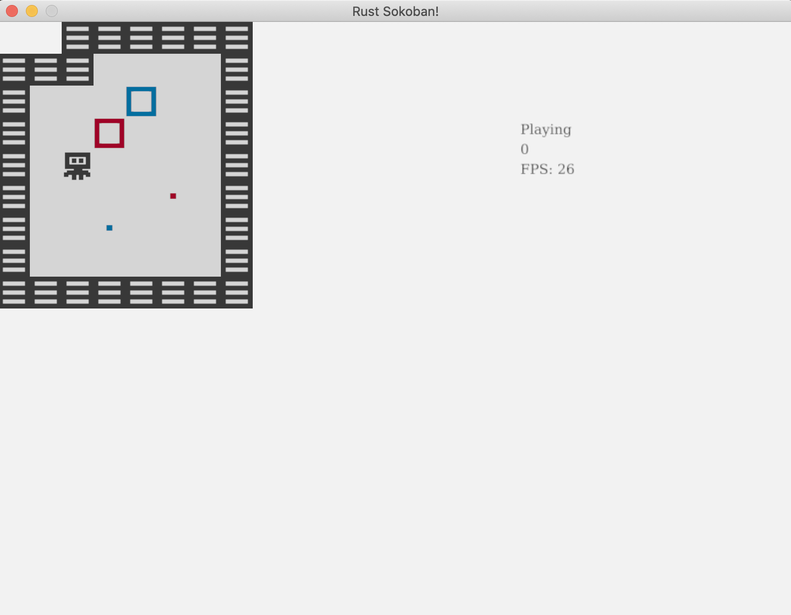
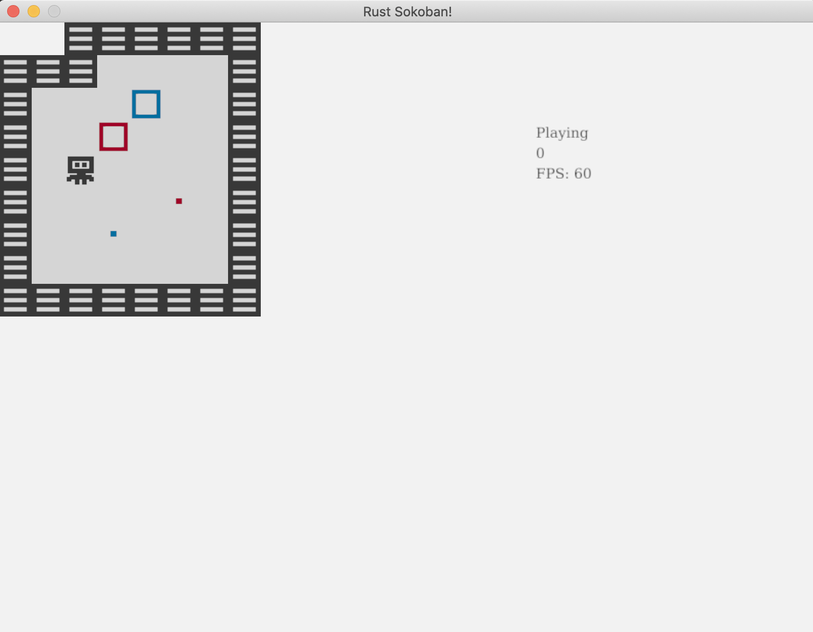

# Renderizado por lotes

Puedes haber notado mientras jugabas el juego que la entrada se siente un tanto lenta. Agreguemos un contador de FPS para ver qué tan rápido estamos renderizando. Si no estás familiarizado con el término FPS, significa fotogramas/cuadros por segundo (del inglés Frames Per Second), y básicamente estamos apuntando a tener 60FPS.

## Contador de FPS
Empecemos agregando un contador de FPS, hay dos partes para ello:
1. obtener o calcular el valor FPS
1. renderizar el valor a la pantalla

Para el 1 afortunadamente ggez nos provee una forma de obtener los fps - ve [aquí](https://docs.rs/ggez/0.7.0/ggez/timer/?search=fps). Para el 2 ya tenemos una forma de renderizar texto en el sistema de renderizado, así que solo debemos llevar el valor de FPS ahí. Pongamos todo esto en el código.

```rust
// rendering_system.rs
{{#include ../../../code/rust-sokoban-c03-04/src/systems/rendering_system.rs:66}}
        ...

{{#include ../../../code/rust-sokoban-c03-04/src/systems/rendering_system.rs:114:118}}

        ...
{{#include ../../../code/rust-sokoban-c03-04/src/systems/rendering_system.rs:123}}
```

Ejecuta el juego y muévete con las teclas un poco y verás que el valor FPS cae muy abajo del esperado 60. A mi me parece que está en el intervalo de 20-30 pero dependiendo de tu máquina podría ser más o menos.



## ¿Qué está causando la caída de FPS?
Ahora podrías estar preguntándote, ¿qué hemos hecho para que sea tan lento? Tenemos un juego bastante simple y nuestra lógica para la entrada y el movimiento en realidad no es tan compleja, tampoco tenemos muchas entidades o componentes para justificar tan grande caída de FPS. Bien, para entender esto necesitamos profundizar en cómo funciona nuestro sistema actual de renderizado.

Actualmente, por cada entidad renderizable, determinamos qué imagen se debe dibujar y la renderizamos. Esto significa que si tenemos 20 casillas de piso cargaremos la imagen 20 veces y lanzaremos 20 llamadas para renderizar de forma separada. Esto es muy costoso y es la causa de nuestra caída masiva de FPS.

¿Cómo podemos arreglarlo? Bien, podemos utilizar una técnica llamada renderizado por lotes. Con esta técnica, lo que hacemos es cargar la imagen una sola vez, e indicar a ggez que la renderice en las 20 posiciones donde debe renderizarse. De esta manera no solo cargamos la imagen una sola vez, sino que también llamamos a renderizar una sola vez por imagen, lo que acelerará las cosas significativamente. Como nota, algunos motores harán este renderizado por lotes por ti, pero ggez no lo hace, por lo que necesitamos ocuparnos de ello nosotros mismos.

## Renderizado por lotes
Aquí está lo que tendremos que hacer para implementar el renderizado por lotes:
* por cada entidad renderizable, determinar cuál imagen necesitamos renderizar y con cuales parámetros de tipo DrawParams (así es como actualmente le indicamos a ggez dónde renderizar)
* guardar todo (la imagen, los DrawParams) en un formato conveniente
* iterar todo (la imagen, los DrawParam) con base en las imágenes ordenadas por z y hacer una sola llamada de renderizado por imagen

Antes de adentrarnos de lleno al código de renderizado, necesitaremos agrupación y ordenamiento de colecciones, y para ello utilizaremos el crate itertools. Podríamos implementar este agrupamiento por nosotros mismos, pero no hay razón para reinventar la rueda. Agreguemos la dependencia itertools a nuestro proyecto.

```toml
// Cargo.toml
{{#include ../../../code/rust-sokoban-c03-04/Cargo.toml:9:13}}
```

También importemoslo en el sistema de renderizado

```rust
// rendering_system.rs
{{#include ../../../code/rust-sokoban-c03-04/src/systems/rendering_system.rs:11}}
```

Ahora, ¿recuerdas la función get_image que escribimos en el capítulo Animaciones para determinar la imagen que necesitábamos para cada fotograma? Podremos reutilizarla solo necesitamos asegurarnos de que no hagamos la carga de la imagen, sino en su lugar retornar su ruta.

```rust
// rendering_system.rs
{{#include ../../../code/rust-sokoban-c03-04/src/systems/rendering_system.rs:36:53}}
```

Ahora determinemos el formato en el que queremos que estén nuestros datos por lotes. Utilizaremos un `HashMap<u8, HashMap<String, Vec<DrawParam>>>` donde:
* la primera clave (`u8`) es la posición z - recuerda que tenemos que respetar las posiciones z y dibujar desde el valor mayor de z hasta el menor para asegurar el orden correcto (por ejemplo los pisos deberían estar debajo del jugador ,etc)
* el valor es otro `HashMap`, donde la segunda clave (`String`) es la ruta a la imagen
* finalmente, el último valor es un `Vec<DrawParam>` que son todos los parámetros con los cuales debemos renderizar esa imagen en particular

Escribamos el código para llenar el mapa hash rendering_batches.

```rust
// rendering_system.rs
{{#include ../../../code/rust-sokoban-c03-04/src/systems/rendering_system.rs:66}}
        ...

{{#include ../../../code/rust-sokoban-c03-04/src/systems/rendering_system.rs:72:94}}

        ...
{{#include ../../../code/rust-sokoban-c03-04/src/systems/rendering_system.rs:123}}
```

Finalmente, rendericemos los lotes. No podremos utilizar la función draw(image) que empleamos antes pero afortunadamente ggez tiene una API por lotes  - [SpriteBatch](https://docs.rs/ggez/0.7.0/ggez/graphics/spritebatch/struct.SpriteBatch.html). También nota aquí el `sorted_by`, que nos es provisto por itertools.

```rust
// rendering_system.rs
{{#include ../../../code/rust-sokoban-c03-04/src/systems/rendering_system.rs:66}}
        ...

{{#include ../../../code/rust-sokoban-c03-04/src/systems/rendering_system.rs:96:112}}

        ...
{{#include ../../../code/rust-sokoban-c03-04/src/systems/rendering_system.rs:123}}
```

¡Y eso es todo! Ejecuta nuevamente el juego y debieras ver un brillante 60FPS y todo debería sentirse mucho más fluido!



> **_CODELINK:_**  Puedes ver el código completo de este ejemplo [aquí](https://github.com/iolivia/rust-sokoban/tree/master/code/rust-sokoban-c03-04).


