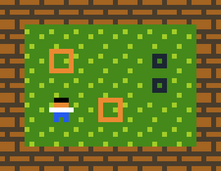

# Entity Component System

В этой главе мы более детально обсудим Sokoban и то, как мы спроектируем нашу игру.

## Sokoban

Here is how a Sokoban game looks like, if you are not familiar with the gameplay already. We have walls and boxes, and the goal is for the player to move the boxes onto their spots by pushing them around.



## ECS

ECS (Entity Component System) is an architectural pattern for writing games which follows the composition over inheritance principle. We will be using ECS heavily in this project, much like most Rust games, so let's spend a bit of time familiarizing ourselves with the key concepts:

- **Components** - data-only structs which hold different characteristics of entities: some examples of components: Position, Renderable, Movement, etc. The key part here is that this is pure data, no behaviour.
- **Entities** (сущности) — могут содержать множество компонентов. Например, игрок может характеризоваться позицией, отображаемостью и передвигаемостью, в то время как пол уровня — только позицией и отображаемостью, так как он неподвижен. Сущности — это просто контейнеры с одним или несколькими компонентами и уникальным идентификатором.
- **Systems** - systems use entities and components and contain behaviour and logic based on that data. For example, you could have a rendering system which just iterates through all entities which contain renderable components and draws all of them. The key here is that the components themselves don't contain any behaviour, instead they use a system to interpret the data and act.

If that doesn't make sense yet don't worry, we will discuss some practical examples in the next section applied to our Sokoban game.

## Архитектура Sokoban

Based on what we know now about how a Sokoban game should work, we will need a few different types of "things": walls, a player, floors, boxes and box spots. These will be our *entities*.

Now we have to identify what these entities will be made of, or what *components* we need. Well first of all we will need to keep track of where everything is on the map, so we need some sort of position component. Secondly, some (but not all) entities can move. The player can move around, but boxes can also move if they get pushed by the player. Finally, we need a way to render each entity, so we need some renderable component.

Вот как выглядит наша идея о сущностях и компонентах:

1. **Игрок**: позиционируемый, отображаемый, передвигаемый
2. **Стена**: позиционируемая, отображаемая
3. **Пол уровня**: позиционируемый, отображаемый
4. **Коробка**: позиционируемая, отображаемая, передвигаемая
5. **Место коробки**: позиционируемое, отображаемое

На первый взгляд мыслить в ECS парадигме может быть сложно, но не огорчайтесь, если вы ничего не поняли или привыкли пользоваться чем-то другим.

## Specs

Наконец, добавим пакет ECS. Их достаточно много, но в этой книге мы будем использовать [specs](https://specs.amethyst.rs/docs/tutorials/).

```
{{#include ../../../code/rust-sokoban-c01-03/Cargo.toml:9:11}}
```

Next up, we'll start implementing entities and components!

> ***КОД:*** Увидеть весь код из данной главы можно [здесь](https://github.com/iolivia/rust-sokoban/tree/master/code/rust-sokoban-c01-03).
