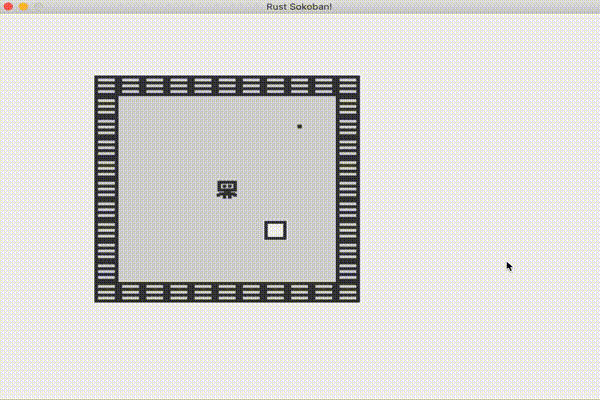

# Moving the player

It wouldn't be a game if we couldn't move the player, would it? In this section we'll be making the player move with the arrow keys.

## Input events
The first step for making our player move is to start listening to input events. If we take a quick look at the [ggez input example](https://github.com/ggez/ggez/blob/master/examples/input_test.rs#L59) we can see we can subscribe to all sort of mouse and keyboard related events, for now we probably only want `key_down_event`.

Let's add this code to `main.rs`.

```rust
impl event::EventHandler for Game {
    ...

    fn key_down_event(
        &mut self,
        _context: &mut Context,
        keycode: KeyCode,
        _keymod: KeyMods,
        _repeat: bool
    ) {
        println!("Key pressed: {:?}", keycode);
    }
}
```

If we run this we should see the print lines in the console.

```
Key pressed: Left
Key pressed: Left
Key pressed: Right
Key pressed: Up
Key pressed: Down
Key pressed: Left
```

## Resources
Next up we'll add a resource, which is the specs way of sharing some state across systems which isn't part of your world. We'll use a resource for modelling the input queue of key presses, since that doens't really fit into our existing components/entities model.

```rust
// Resources
#[derive(Default)]
pub struct InputQueue {
    pub keys_pressed: Vec<KeyCode>
}


...
    fn key_down_event(
        &mut self,
        _context: &mut Context,
        keycode: KeyCode,
        _keymod: KeyMods,
        _repeat: bool
    ) {
        println!("Key pressed: {:?}", keycode);

        let mut input_queue = self.world.write_resource::<InputQueue>();
        input_queue.keys_pressed.push(keycode);
    }
...

// Register resources
pub fn register_resources(world: &mut World) {
    world.insert(InputQueue::default())
}

pub fn main() -> GameResult {
    let mut world = World::new();
    register_components(&mut world);
    register_resources(&mut world);

    ...
}
```

Using this code we have a resource that is a continuous queue of input key presses. Next up, we'll start processing these inputs in a system.

## Moving the player

```rust

// Implement an input system
pub struct InputSystem {}

// System implementation
impl<'a> System<'a> for InputSystem {
    // Data
    type SystemData = (
        Write<'a, InputQueue>, 
        WriteStorage<'a, Position>, 
        ReadStorage<'a, Player>
    );

    fn run(&mut self, data: Self::SystemData) {
        let (mut input_queue, mut positions, players) = data;

        for (position, _player) in (&mut positions, &players).join() {
            // Get the first key pressed
            let key = input_queue.keys_pressed.pop();

            // Apply the key to the position
            let (x_tile_offset, y_tile_offset) = match key {
                Some(KeyCode::Up) => (0, -1),
                Some(KeyCode::Down) => (0, 1),
                Some(KeyCode::Left) => (-1, 0),
                Some(KeyCode::Right) => (1, 0),
                _ => (0, 0)
            };

            position.x += TILE_WIDTH * x_tile_offset as f32;
            position.y += TILE_WIDTH * y_tile_offset as f32;
        }
    }
}

// Run the input system in the update function
fn update(&mut self, _context: &mut Context) -> GameResult {

    // Run input system
    {
        let mut is = InputSystem {};
        is.run_now(&self.world);
    }

    Ok(())
}
```

The input system is pretty simple, it grabs all the players and positions (we should only have one player but this code doesn't need to care about that, it could in theory work if we have multiple players that we want to control with the same input). And then for every player and position combination, it will grab the first key pressed and remove it from the input queue. It will then figure out what is the required transformation - for example if we press up we want to move one tile up (or 1 * TILE_WIDTH) and so on, and then applies this position update.

Pretty cool! Here's how it should look like. Full code below.



```rust
use specs::WriteStorage;
use ggez;
use ggez::event::KeyCode;
use ggez::event::KeyMods;
use ggez::graphics;
use ggez::graphics::DrawParam;
use ggez::graphics::Image;
use ggez::nalgebra as na;
use ggez::{conf, event, Context, GameResult};
use specs::{
    join::Join, Builder, Component, ReadStorage, RunNow, System, VecStorage, World, WorldExt, Read, Write,
};

use std::path;

const TILE_WIDTH: f32 = 32.0;

// Components
#[derive(Debug, Component)]
#[storage(VecStorage)]
pub struct Position {
    x: f32,
    y: f32,
}

#[derive(Component)]
#[storage(VecStorage)]
pub struct Renderable {
    path: String,
}

#[derive(Component)]
#[storage(VecStorage)]
pub struct Wall {}

#[derive(Component)]
#[storage(VecStorage)]
pub struct Player {}

#[derive(Component)]
#[storage(VecStorage)]
pub struct Box {}

#[derive(Component)]
#[storage(VecStorage)]
pub struct BoxSpot {}

// Resources
#[derive(Default)]
pub struct InputQueue {
    pub keys_pressed: Vec<KeyCode>
}

// Systems
pub struct RenderingSystem<'a> {
    context: &'a mut Context,
}

// System implementation
impl<'a> System<'a> for RenderingSystem<'a> {
    // Data
    type SystemData = (ReadStorage<'a, Position>, ReadStorage<'a, Renderable>);

    fn run(&mut self, data: Self::SystemData) {
        let (positions, renderables) = data;

        // Clearing the screen (this gives us the backround colour)
        graphics::clear(self.context, graphics::Color::new(0.95, 0.95, 0.95, 1.0));

        // // Iterate through all pairs of positions & renderables, load the image
        // // and draw it at the specified position.
        for (position, renderable) in (&positions, &renderables).join() {
            // Load the image
            let image = Image::new(self.context, renderable.path.clone()).expect("expected image");

            // draw
            let draw_params = DrawParam::new().dest(na::Point2::new(position.x, position.y));
            graphics::draw(self.context, &image, draw_params).expect("expected render");
        }

        // Finally, present the context, this will actually display everything
        // on the screen.
        graphics::present(self.context).expect("expected to present");
    }
}

pub struct InputSystem {}

// System implementation
impl<'a> System<'a> for InputSystem {
    // Data
    type SystemData = (
        Write<'a, InputQueue>, 
        WriteStorage<'a, Position>, 
        ReadStorage<'a, Player>
    );

    fn run(&mut self, data: Self::SystemData) {
        let (mut input_queue, mut positions, players) = data;

        for (position, _player) in (&mut positions, &players).join() {
            // Get the first key pressed
            let key = input_queue.keys_pressed.pop();

            // Apply the key to the position
            let (x_tile_offset, y_tile_offset) = match key {
                Some(KeyCode::Up) => (0, -1),
                Some(KeyCode::Down) => (0, 1),
                Some(KeyCode::Left) => (-1, 0),
                Some(KeyCode::Right) => (1, 0),
                _ => (0, 0)
            };

            position.x += TILE_WIDTH * x_tile_offset as f32;
            position.y += TILE_WIDTH * y_tile_offset as f32;
        }
    }
}

// This struct will hold all our game state
// For now there is nothing to be held, but we'll add
// things shortly.
struct Game {
    world: World,
}

// This is the main event loop. ggez tells us to implement
// two things:
// - updating
// - rendering
impl event::EventHandler for Game {
    fn update(&mut self, _context: &mut Context) -> GameResult {

        // Run input system
        {
            let mut is = InputSystem {};
            is.run_now(&self.world);
        }

        Ok(())
    }

    fn draw(&mut self, context: &mut Context) -> GameResult {
        // Render game entities
        {
            let mut rs = RenderingSystem { context };
            rs.run_now(&self.world);
        }

        Ok(())
    }

    fn key_down_event(
        &mut self,
        _context: &mut Context,
        keycode: KeyCode,
        _keymod: KeyMods,
        _repeat: bool
    ) {
        println!("Key pressed: {:?}", keycode);

        let mut input_queue = self.world.write_resource::<InputQueue>();
        input_queue.keys_pressed.push(keycode);
    }
}

// Register components with the world
pub fn register_components(world: &mut World) {
    world.register::<Position>();
    world.register::<Renderable>();
    world.register::<Player>();
    world.register::<Wall>();
    world.register::<Box>();
    world.register::<BoxSpot>();
}

// Register resources
pub fn register_resources(world: &mut World) {
    world.insert(InputQueue::default())
}

// Create a wall entity
pub fn create_wall(world: &mut World, position: Position) {
    world
        .create_entity()
        .with(position)
        .with(Renderable {
            path: "/images/wall.png".to_string(),
        })
        .with(Wall {})
        .build();
}

pub fn create_floor(world: &mut World, position: Position) {
    world
        .create_entity()
        .with(position)
        .with(Renderable {
            path: "/images/floor.png".to_string(),
        })
        .build();
}

pub fn create_box(world: &mut World, position: Position) {
    world
        .create_entity()
        .with(position)
        .with(Renderable {
            path: "/images/box.png".to_string(),
        })
        .with(Box {})
        .build();
}

pub fn create_box_spot(world: &mut World, position: Position) {
    world
        .create_entity()
        .with(position)
        .with(Renderable {
            path: "/images/box_spot.png".to_string(),
        })
        .with(BoxSpot {})
        .build();
}

pub fn create_player(world: &mut World, position: Position) {
    world
        .create_entity()
        .with(position)
        .with(Renderable {
            path: "/images/player.png".to_string(),
        })
        .with(Player {})
        .build();
}

pub fn create_map(world: &mut World) {
    let width = 10;
    let height = 10;
    let (offset_x, offset_y) = (4, 3); // make the map somewhat centered

    for x in 0..=width {
        for y in 0..=height {
            let create = match (x, y) {
                (x, y) if x == 0 || x == width || y == 0 || y == height => create_wall,
                (5, 5) => create_player,
                (7, 7) => create_box,
                (8, 2) => create_box_spot,
                _ => create_floor,
            };
            create(
                world,
                Position {
                    x: TILE_WIDTH * (x + offset_x) as f32,
                    y: TILE_WIDTH * (y + offset_y) as f32,
                },
            );
        }
    }
}

// Initialize the level
pub fn initialize_level(world: &mut World) {
    create_map(world);
}

pub fn main() -> GameResult {
    let mut world = World::new();
    register_components(&mut world);
    register_resources(&mut world);
    initialize_level(&mut world);

    // Create a game context and event loop
    let context_builder = ggez::ContextBuilder::new("rust_sokoban", "sokoban")
        .window_setup(conf::WindowSetup::default().title("Rust Sokoban!"))
        .window_mode(conf::WindowMode::default().dimensions(800.0, 600.0))
        .add_resource_path(path::PathBuf::from("./resources"));

    let (context, event_loop) = &mut context_builder.build()?;

    // Create the game state
    let game = &mut Game { world };
    // Run the main event loop
    event::run(context, event_loop, game)
}
```