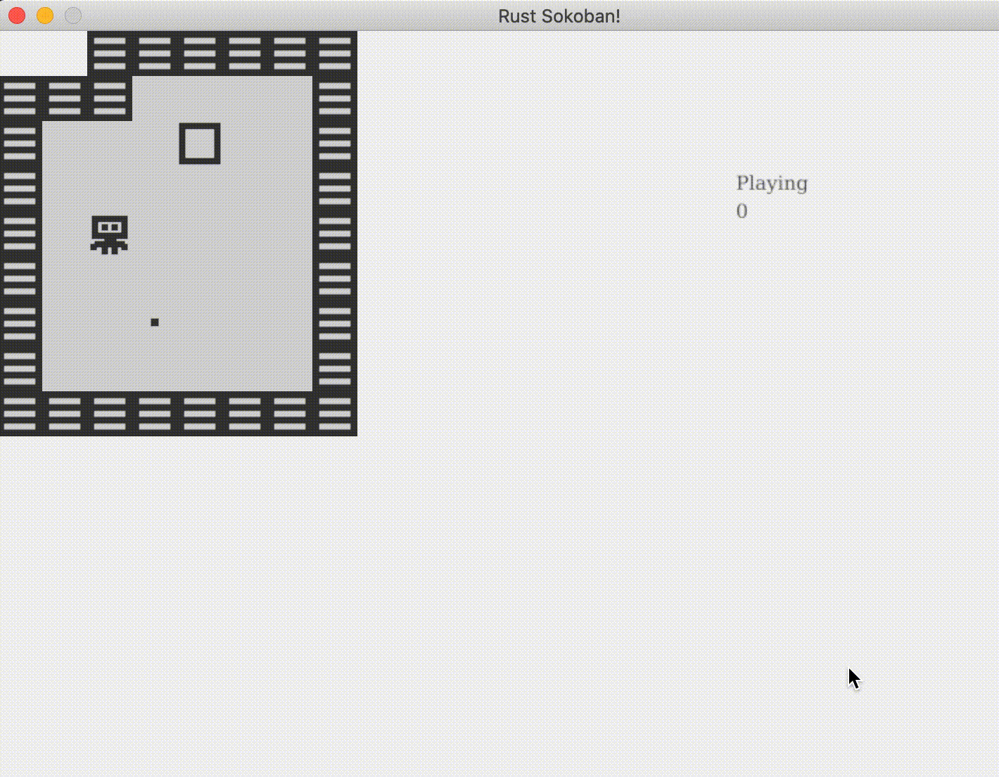

# Counting moves

Now that the player can win, we want to count how many moves it took them to win. This will allow us to have a leaderboard later if we choose to and give the player an indication of how well they did based on the minimum number of moves that lead to a win.

We could simply count every time a key has been pressed. But that doesn't quite work because then we'll be counting also when the player tries to move, but hits a wall. So what we really want is to count when our moving logic decides the player must move.

Let's first add the number of moves as a field to our gameplay object.

```rust
#[derive(Default)]
pub struct Gameplay {
    pub state: GameplayState,
    pub moves_count: u32 // number of moves we will be keeping track of
}
```

Now let's add the increment to the number of moves into the input system.

```rust
// System implementation
impl<'a> System<'a> for InputSystem {
    // Data
    type SystemData = (
        Write<'a, InputQueue>,
        Write<'a, Gameplay>,  // added gameplay here
        Entities<'a>,
        WriteStorage<'a, Position>,
        ReadStorage<'a, Player>,
        ReadStorage<'a, Movable>,
        ReadStorage<'a, Immovable>,
    );

    fn run(&mut self, data: Self::SystemData) {

        let (
            mut input_queue,
            mut gameplay, // added gameplay here
            entities,
            mut positions,
            players,
            movables,
            immovables
        ) = data;

        let mut to_move = Vec::new();

        // ....

        // We've just moved, so let's increase the number of moves
        if to_move.len() > 0 {
            gameplay.moves_count += 1;
        }

        // Now actually move what needs to be moved
        for (key, id) in to_move {
            // ....
        }
    }
}
```

And finally, let's render the number of moves below the gameplay state in the rendering system.

```rust
impl<'a> System<'a> for RenderingSystem<'a> {
    // Data
    type SystemData = (
        Read<'a, Gameplay>,
        ReadStorage<'a, Position>,
        ReadStorage<'a, Renderable>
    );

    fn run(&mut self, data: Self::SystemData) {
        let (gameplay, positions, renderables) = data;

        // ...

        // Render any text
        self.draw_text(&gameplay.state.to_string(), 525.0, 80.0);
        self.draw_text(&gameplay.moves_count.to_string(), 525.0, 100.0); // render the moves count

        // Finally, present the context, this will actually display everything
        // on the screen.
        graphics::present(self.context).expect("expected to present");
    }
}
```

Here's how it looks on the screen. Notice how when we try to go through the wall on the right the number of moves doesn't go up because we only move if movement has actually happened not only if a key was pressed.




Here is the final code.

```rust
use specs::Entities;
use specs::NullStorage;
use specs::WriteStorage;
use ggez;
use ggez::event::KeyCode;
use ggez::event::KeyMods;
use ggez::graphics;
use ggez::graphics::DrawParam;
use ggez::graphics::Image;
use ggez::graphics::Color;
use ggez::nalgebra as na;
use ggez::{conf, event, Context, GameResult};
use specs::{
    join::Join, Builder, Component, ReadStorage, RunNow,
    System, VecStorage, World, WorldExt, Write, Read
};
use specs::world::Index;

use std::path;
use std::collections::HashMap;
use std::fmt;
use std::fmt::Display;

const TILE_WIDTH: f32 = 32.0;
const MAP_WIDTH: u8 = 10;
const MAP_HEIGHT: u8 = 10;
const MAP_OFFSET_X: u8 = 4;
const MAP_OFFSET_Y: u8 = 3;

// Components
#[derive(Debug, Component, Clone, Copy)]
#[storage(VecStorage)]
pub struct Position {
    x: u8,
    y: u8,
    z: u8
}

#[derive(Component)]
#[storage(VecStorage)]
pub struct Renderable {
    path: String,
}

#[derive(Component)]
#[storage(VecStorage)]
pub struct Wall {}

#[derive(Component)]
#[storage(VecStorage)]
pub struct Player {}

#[derive(Component)]
#[storage(VecStorage)]
pub struct Box {}

#[derive(Component)]
#[storage(VecStorage)]
pub struct BoxSpot {}

#[derive(Component, Default)]
#[storage(NullStorage)]
pub struct Movable;

#[derive(Component, Default)]
#[storage(NullStorage)]
pub struct Immovable;

// Resources
#[derive(Default)]
pub struct InputQueue {
    pub keys_pressed: Vec<KeyCode>
}

pub enum GameplayState {
    Playing,
    Won,
}

impl Display for GameplayState {
    fn fmt(&self, fmt: &mut fmt::Formatter) -> fmt::Result {
        fmt.write_str(
            match self {
                GameplayState::Playing => "Playing",
                GameplayState::Won => "Won"
            }
        )?;
        Ok(())
    }
}

impl Default for GameplayState {
    fn default() -> Self {
        Self::Playing
    }
}

#[derive(Default)]
pub struct Gameplay {
    pub state: GameplayState,
    pub moves_count: u32
}

// Systems
pub struct RenderingSystem<'a> {
    context: &'a mut Context,
}

impl RenderingSystem<'_> {
    pub fn draw_text(&mut self, text_string: &str, x: f32, y: f32) {
        let text = graphics::Text::new(text_string);
        let destination = na::Point2::new(x, y);
        let color = Some(Color::new(0.0, 0.0, 0.0, 1.0));
        let dimensions = na::Point2::new(0.0, 20.0);

        graphics::queue_text(self.context, &text, dimensions, color);
        graphics::draw_queued_text(
            self.context,
            graphics::DrawParam::new().dest(destination),
            None,
            graphics::FilterMode::Linear,
        )
        .expect("expected drawing queued text");
    }
}

// System implementation
impl<'a> System<'a> for RenderingSystem<'a> {
    // Data
    type SystemData = (
        Read<'a, Gameplay>,
        ReadStorage<'a, Position>,
        ReadStorage<'a, Renderable>
    );

    fn run(&mut self, data: Self::SystemData) {
        let (gameplay, positions, renderables) = data;

        // Clearing the screen (this gives us the backround colour)
        graphics::clear(self.context, graphics::Color::new(0.95, 0.95, 0.95, 1.0));

        // Get all the renderables with their positions and sort by the position z
        // This will allow us to have entities layered visually.
        let mut rendering_data = (&positions, &renderables).join().collect::<Vec<_>>();
        rendering_data.sort_by(|&a, &b| a.0.z.partial_cmp(&b.0.z).expect("expected comparison"));

        // Iterate through all pairs of positions & renderables, load the image
        // and draw it at the specified position.
        for (position, renderable) in rendering_data.iter() {

            // Load the image
            let image = Image::new(self.context, renderable.path.clone()).expect("expected image");
            let x = (MAP_OFFSET_X + position.x) as f32 * TILE_WIDTH;
            let y = (MAP_OFFSET_Y + position.y) as f32 * TILE_WIDTH;

            // draw
            let draw_params = DrawParam::new().dest(na::Point2::new(x, y));
            graphics::draw(self.context, &image, draw_params).expect("expected render");
        }

        // Render any text
        self.draw_text(&gameplay.state.to_string(), 525.0, 80.0);
        self.draw_text(&gameplay.moves_count.to_string(), 525.0, 100.0);

        // Finally, present the context, this will actually display everything
        // on the screen.
        graphics::present(self.context).expect("expected to present");
    }
}

pub struct InputSystem {}

// System implementation
impl<'a> System<'a> for InputSystem {
    // Data
    type SystemData = (
        Write<'a, InputQueue>,
        Write<'a, Gameplay>,
        Entities<'a>,
        WriteStorage<'a, Position>,
        ReadStorage<'a, Player>,
        ReadStorage<'a, Movable>,
        ReadStorage<'a, Immovable>,
    );

    fn run(&mut self, data: Self::SystemData) {

        let (
            mut input_queue,
            mut gameplay,
            entities,
            mut positions,
            players,
            movables,
            immovables
        ) = data;

        let mut to_move = Vec::new();

        for (position, _player) in (&positions, &players).join() {
            // Get the first key pressed
            if let Some(key) = input_queue.keys_pressed.pop() {

                // get all the movables and immovables
                let mut mov: HashMap<(u8, u8), Index> = (&entities, &movables, &positions)
                    .join()
                    .collect::<Vec<_>>()
                    .into_iter()
                    .map(|t| ((t.2.x, t.2.y), t.0.id()))
                    .collect::<HashMap<_, _>>();
                let mut immov: HashMap<(u8, u8), Index> = (&entities, &immovables, &positions)
                    .join()
                    .collect::<Vec<_>>()
                    .into_iter()
                    .map(|t| ((t.2.x, t.2.y), t.0.id()))
                    .collect::<HashMap<_, _>>();

                // Now iterate through current position to the end of the map
                // on the correct axis and check what needs to move.
                let (start, end, is_x) = match key {
                    KeyCode::Up => (position.y, 0, false),
                    KeyCode::Down => (position.y, MAP_HEIGHT, false),
                    KeyCode::Left => (position.x, 0, true),
                    KeyCode::Right => (position.x, MAP_WIDTH, true),
                    _ => continue
                };

                let range = if start < end {
                    (start..=end).collect::<Vec<_>>()
                } else {
                    (end..=start).rev().collect::<Vec<_>>()
                };

                for x_or_y in range {
                    let pos = if is_x {
                        (x_or_y, position.y)
                    } else {
                        (position.x, x_or_y)
                    };

                    // find a movable
                    // if it exists, we try to move it and continue
                    // if it doesn't exist, we continue and try to find an immovable instead
                    match mov.get(&pos) {
                        Some(id) => to_move.push((key, id.clone())),
                        None => {
                            // find an immovable
                            // if it exists, we need to stop and not move anything
                            // if it doesn't exist, we stop because we found a gap
                            match immov.get(&pos) {
                                Some(id) => to_move.clear(),
                                None => break
                            }
                        }
                    }
                }
            }
        }

        // We've just moved, so let's increase the number of moves
        if to_move.len() > 0 {
            gameplay.moves_count += 1;
        }

        // Now actually move what needs to be moved
        for (key, id) in to_move {
            let position = positions.get_mut(entities.entity(id));
            if let Some(position) = position {
                match key {
                    KeyCode::Up => position.y -= 1,
                    KeyCode::Down => position.y += 1,
                    KeyCode::Left => position.x -= 1,
                    KeyCode::Right => position.x += 1,
                    _ => ()
                }
            }
        }
    }
}

pub struct GameplayStateSystem {}

// System implementation
impl<'a> System<'a> for GameplayStateSystem {
    // Data
    type SystemData = (
        Write<'a, Gameplay>,
        ReadStorage<'a, Position>,
        ReadStorage<'a, Box>,
        ReadStorage<'a, BoxSpot>,
    );

    fn run(&mut self, data: Self::SystemData) {

        let (
            mut gameplay_state,
            positions,
            boxes,
            box_spots
        ) = data;

        // get all boxes indexed by position
        let mut boxes_by_position: HashMap<(u8, u8), &Box> = (&positions, &boxes)
            .join()
            .collect::<Vec<_>>()
            .into_iter()
            .map(|t| ((t.0.x, t.0.y), t.1))
            .collect::<HashMap<_, _>>();

        // loop through all box spots and check if there is a corresponding
        // box at that position.
        for (_box_spot, position) in (&box_spots, &positions).join() {
            if boxes_by_position.contains_key(&(position.x, position.y)) {
                // continue
            } else {
                gameplay_state.state = GameplayState::Playing;
                return;
            }
        }

        // if we made it this far, then all box spots have boxes on them, and
        // therefore the game has been won.
        gameplay_state.state = GameplayState::Won;
    }
}

// This struct will hold all our game state
// For now there is nothing to be held, but we'll add
// things shortly.
struct Game {
    world: World,
}

// This is the main event loop. ggez tells us to implement
// two things:
// - updating
// - rendering
impl event::EventHandler for Game {
    fn update(&mut self, _context: &mut Context) -> GameResult {

        // Run input system
        {
            let mut is = InputSystem {};
            is.run_now(&self.world);
        }

        // Run gameplay state system
        {
            let mut gss = GameplayStateSystem {};
            gss.run_now(&self.world);
        }


        Ok(())
    }

    fn draw(&mut self, context: &mut Context) -> GameResult {
        // Render game entities
        {
            let mut rs = RenderingSystem { context };
            rs.run_now(&self.world);
        }

        Ok(())
    }

    fn key_down_event(
        &mut self,
        _context: &mut Context,
        keycode: KeyCode,
        _keymod: KeyMods,
        _repeat: bool
    ) {
        println!("Key pressed: {:?}", keycode);

        let mut input_queue = self.world.write_resource::<InputQueue>();
        input_queue.keys_pressed.push(keycode);
    }
}

// Register components with the world
pub fn register_components(world: &mut World) {
    world.register::<Position>();
    world.register::<Renderable>();
    world.register::<Player>();
    world.register::<Wall>();
    world.register::<Box>();
    world.register::<BoxSpot>();
    world.register::<Movable>();
    world.register::<Immovable>();
}

// Register resources
pub fn register_resources(world: &mut World) {
    world.insert(InputQueue::default());
    world.insert(Gameplay::default());
}

// Z positions
// Wall: 10
// Floor: 5
// Box: 10
// Box spot: 9
// Player: 10

// Create a wall entity
pub fn create_wall(world: &mut World, position: Position) {
    world
        .create_entity()
        .with(Position {z: 10, ..position})
        .with(Renderable {
            path: "/images/wall.png".to_string(),
        })
        .with(Wall {})
        .with(Immovable)
        .build();
}

pub fn create_floor(world: &mut World, position: Position) {
    world
        .create_entity()
        .with(Position {z: 5, ..position})
        .with(Renderable {
            path: "/images/floor.png".to_string(),
        })
        .build();
}

pub fn create_box(world: &mut World, position: Position) {
    world
        .create_entity()
        .with(Position {z: 10, ..position})
        .with(Renderable {
            path: "/images/box.png".to_string(),
        })
        .with(Box {})
        .with(Movable)
        .build();
}

pub fn create_box_spot(world: &mut World, position: Position) {
    world
        .create_entity()
        .with(Position {z: 9, ..position})
        .with(Renderable {
            path: "/images/box_spot.png".to_string(),
        })
        .with(BoxSpot {})
        .build();
}

pub fn create_player(world: &mut World, position: Position) {
    world
        .create_entity()
        .with(Position {z: 10, ..position})
        .with(Renderable {
            path: "/images/player.png".to_string(),
        })
        .with(Player {})
        .with(Movable)
        .build();
}

pub fn create_map(world: &mut World) {
    let no_op = |_world: &mut World, _position: Position| {};

    for x in 0..=MAP_WIDTH {
        for y in 0..=MAP_HEIGHT {

            // Create the position at which to create something on the map
            let position = Position {
                x: x,
                y: y,
                z: 0 // we will get the z from the factory functions
            };

            // Figure out what object we should create
            let create = match (x, y) {
                (x, y) if x == 0 || x == MAP_WIDTH || y == 0 || y == MAP_HEIGHT => create_wall,
                (5, 5) => create_player,
                (6, 5) => create_box,
                (7, 5) => create_box,
                (8, 2) => create_box_spot,
                _ => no_op,
            };

            // Create floor and create the special objects
            create_floor(world, position);
            create(world, position);
        }
    }
}

// Initialize the level
pub fn initialize_level(world: &mut World) {
    create_map(world);
}

pub fn main() -> GameResult {
    let mut world = World::new();
    register_components(&mut world);
    register_resources(&mut world);
    initialize_level(&mut world);

    // Create a game context and event loop
    let context_builder = ggez::ContextBuilder::new("rust_sokoban", "sokoban")
        .window_setup(conf::WindowSetup::default().title("Rust Sokoban!"))
        .window_mode(conf::WindowMode::default().dimensions(800.0, 600.0))
        .add_resource_path(path::PathBuf::from("./resources"));

    let (context, event_loop) = &mut context_builder.build()?;

    // Create the game state
    let game = &mut Game { world };
    // Run the main event loop
    event::run(context, event_loop, game)
}
```
